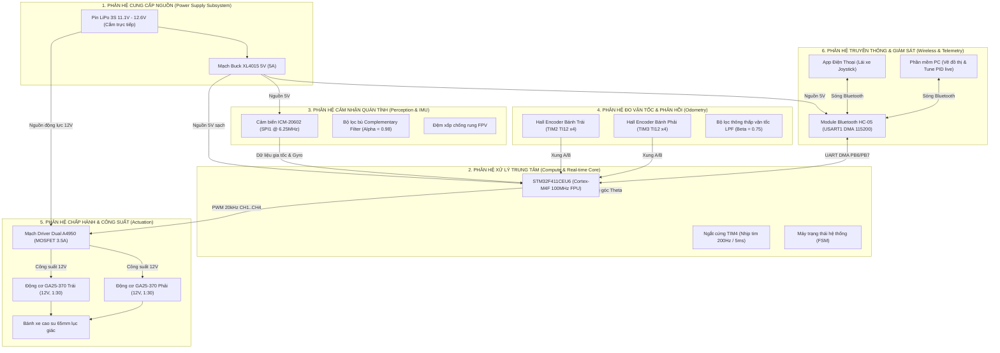
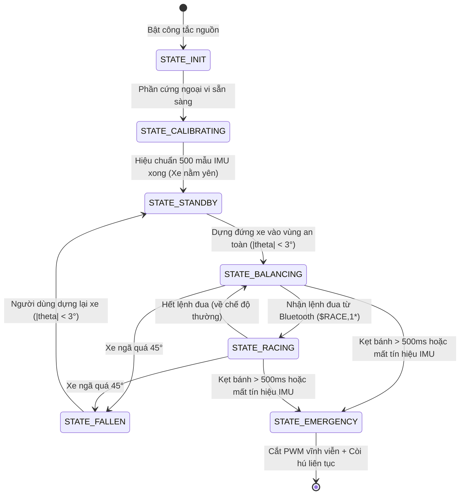

# CẤU TRÚC TỔNG THỂ ĐỒ ÁN — XE CÂN BẰNG 2 BÁNH TỐC ĐỘ CAO
### (Two-Wheeled Self-Balancing Robot: System Architecture, Subsystems & Operational Design)

> [!NOTE]
> * **Định hướng tài liệu**: Cung cấp bức tranh toàn cảnh về **kiến trúc hệ thống, các phân hệ chức năng, luồng vận hành thời gian thực, ma trận kết nối phần cứng và quy trình thực hiện đồ án**.
> * **Trọng tâm**: Mô tả bản chất kỹ thuật của đồ án thay vì liệt kê cấu trúc cây thư mục mã nguồn.

---

## 1. MỤC TIÊU & CHỈ SỐ KỸ THUẬT CỦA ĐỒ ÁN (PROJECT SPECIFICATIONS)

Đồ án tập trung nghiên cứu, thiết kế và chế tạo một Robot 2 bánh tự cân bằng (Two-Wheeled Inverted Pendulum - TWIP) tích hợp 2 chế độ hoạt động: **Tự đứng thăng bằng ổn định tại chỗ** và **Đua tốc độ cao (High-Speed Racing)**.

```
       [TỰ ĐỨNG CÂN BẰNG TẠI CHỖ]                [CHẾ ĐỘ ĐUA TỐC ĐỘ CAO]
   • Góc ngả bù: 0°                           • Chủ động ngả người: tới 15°
   • Vận tốc: v = 0 m/s                       • Vận tốc đua: > 1.5 - 2.0 m/s
   • Tự bù lệch trọng tâm tĩnh                • Bù vi sai bẻ lái thích ứng tốc độ
   • Trôi vị trí (Drift): ~ 0 cm              • Chống lật ngang khi vào cua gắt
```

### Các chỉ số kỹ thuật cốt lõi (Target KPIs):
| Chỉ số kỹ thuật | Giá trị mục tiêu | Ý nghĩa kỹ thuật |
| :--- | :---: | :--- |
| **Tần số vòng lặp điều khiển chính** | **200 Hz (chu kỳ 5.0 ms)** | Đảm bảo tính thời gian thực; phản ứng đủ nhanh để dập tắt dao động của con lắc ngược. |
| **Vận tốc tối đa ở chế độ Đua** | **$\ge 1.5 - 2.0\text{ m/s}$** | Động cơ GA25 12V 300RPM kết hợp bánh 65mm cho tốc độ tối đa lý thuyết $\approx 1.02\text{ m/s}$ không tải; khi ngả góc đua có thể bứt tốc mạnh. |
| **Góc nghiêng cho phép (Chế độ thường)** | **$\pm 8.0^\circ$** | Vùng hoạt động an toàn khi di chuyển chậm hoặc đứng yên. |
| **Góc nghiêng cho phép (Chế độ đua)** | **$\pm 15.0^\circ$** | Mở rộng góc nghiêng để trọng lực sinh mô-men kéo gia tốc lớn về phía trước. |
| **Thời gian ổn định (Settling Time)** | **$< 1.5\text{ giây}$** | Thời gian dập tắt hoàn toàn dao động sau khi bị ngoại lực đẩy nhẹ. |
| **Góc cắt an toàn khẩn cấp (Fall Cutoff)** | **$|\theta| > 45.0^\circ$** | Ngắt tức thì xung PWM về 0 trong $< 5\text{ms}$ khi xe ngã để bảo vệ motor và driver. |
| **Tần số xung PWM động cơ** | **20 kHz đối xứng tâm** | Nằm ngoài ngưỡng nghe tai người (không rít cuộn cảm); giảm 50% sóng hài dòng điện. |
| **Tần số gửi Telemetry lên máy tính** | **20 Hz (mỗi 50 ms)** | Tối ưu hóa băng thông Bluetooth 115200 bps; đủ mịn để vẽ đồ thị thời gian thực. |

---

## 2. KIẾN TRÚC 6 PHÂN HỆ CHỨC NĂNG (THE 6 CORE SUBSYSTEMS)

Toàn bộ hệ thống xe cân bằng được cấu thành từ **6 phân hệ chức năng** liên kết chặt chẽ với nhau:



### Chi tiết nhiệm vụ từng phân hệ:

### 2.1. Phân hệ Xử lý trung tâm & Thời gian thực (Compute & Real-time Core)
* **Thành phần cốt lõi**: STM32F411CEU6 Black Pill (ARM Cortex-M4F, 100MHz, FPU, 512KB Flash, 128KB SRAM).
* **Nhiệm vụ**:
  * Là "nhạc trưởng" điều phối mọi hoạt động.
  * Cung cấp bộ định thời phần cứng chính xác tuyệt đối **200Hz (5ms)** không bị trôi pha.
  * Tận dụng bộ tăng tốc phần cứng FPU để tính toán toàn bộ phương trình vi phân, lượng giác và giải thuật Cascade PID 2 vòng trong thời gian $< 1.0\text{ ms}$.

### 2.2. Phân hệ Cảm nhận quán tính & Lọc trạng thái (Perception & State Estimation)
* **Thành phần cốt lõi**: Cảm biến IMU 6 trục ICM-20602, đệm xốp chống rung, giao tiếp SPI tốc độ 6.25MHz.
* **Nhiệm vụ**:
  * Đo vận tốc góc ngã của xe quanh trục Pitch ($\omega_{\text{gyro}}$) với dải đo lớn $\pm 2000^\circ/\text{s}$.
  * Đo vectơ trọng lực bằng gia tốc kế 3 trục ($A_x, A_y, A_z$) với dải đo $\pm 8\text{g}$.
  * Chạy giải thuật **Bộ lọc bù (Complementary Filter $\alpha = 0.98$)** để kết hợp ưu thế không trễ của Gyro và không trôi của Accel, tạo ra góc nghiêng thực $\theta$ siêu mịn.

### 2.3. Phân hệ Đo lường phản hồi vị trí & Vận tốc (Odometry Feedback)
* **Thành phần cốt lõi**: 2 đĩa từ Hall gắn ở đuôi động cơ GA25-370, giải mã qua chế độ `TIM_ENCODERMODE_TI12` của STM32.
* **Nhiệm vụ**:
  * Đếm 4 sườn xung của 2 kênh vuông pha A/B $\implies 1320\text{ xung/vòng bánh xe}$.
  * Tính toán chính xác vận tốc tịnh tiến $v$ (m/s) và quãng đường di chuyển của xe mỗi 5ms.
  * Áp dụng bộ lọc thông thấp (LPF $\beta = 0.75$) để khử nhiễu lượng tử hóa xung ở tốc độ chậm.

### 2.4. Phân hệ Chấp hành & Điều khiển công suất (Actuation & Motor Drive)
* **Thành phần cốt lõi**: Mạch Driver Dual A4950 (cầu H MOSFET 3.5A dòng đỉnh), 2 động cơ giảm tốc GA25-370 (12V, 1:30), cặp bánh xe cao su lục giác 65mm.
* **Nhiệm vụ**:
  * Khuếch đại tín hiệu điều khiển từ STM32 thành dòng điện công suất lớn (lên tới 2A - 3A ở 12V) cấp cho cuộn cảm động cơ.
  * Điều chế độ rộng xung PWM ở tần số **20kHz** đối xứng tâm (Center-aligned Mode).
  * Vận hành ở chế độ **Slow Decay** (1 chân PWM, 1 chân GND) giúp đáp ứng lực mô-men quay mượt mà, tuyến tính và không gây nóng driver.

### 2.5. Phân hệ Cung cấp Nguồn (Power Distribution & Plug-and-Play)
* **Thành phần cốt lõi**: Khối pin LiPo 3S 11.1V (dòng xả cao 25C - 35C), giắc cắm nguồn XT60, mạch hạ áp Buck XL4015 5A.
* **Nhiệm vụ & Thiết kế tối giản**:
  * Cung cấp nguồn 12V trực tiếp từ giắc cắm XT60 tới mạch công suất Driver Dual A4950.
  * Mạch Buck XL4015 hạ áp từ 12V xuống 5.0V ổn định cung cấp nguồn nuôi số cho STM32, ICM-20602 và Bluetooth.
  * **Vận hành tiện lợi (Plug-and-Play)**: Xe phục vụ thực nghiệm giải thuật và chạy biểu diễn trong thời gian ngắn, người dùng chỉ cần sạc pin LiPo thật đầy trước khi chơi, cắm giắc XT60 vào xe là sẵn sàng điều khiển. Hệ thống lược bỏ hoàn toàn khối đo ADC và cầu chia áp để tinh giản tối đa phần cứng, tiết kiệm chân MCU và loại bỏ xử lý dư thừa trong phần mềm.

### 2.6. Phân hệ Truyền thông không dây & Giám sát từ xa (Wireless Telemetry & Teleoperation)
* **Thành phần cốt lõi**: Module Bluetooth HC-05 (115200 bps), ứng dụng điều khiển Joystick trên điện thoại, phần mềm đồ thị VOFA+ trên PC.
* **Nhiệm vụ**:
  * **Nhận lệnh lái (Uplink)**: Nhận lệnh vận tốc $v_{\text{target}}$ và lệnh rẽ $steer$ qua cơ chế UART DMA + Idle Line không chặn nhịp điều khiển.
  * **Xuất đồ thị thời gian thực (Downlink 20Hz)**: Đóng gói góc nghiêng, góc đặt, vận tốc, PWM gửi lên PC để hiển thị đồ thị đáp ứng bước (Step Response), phục vụ tune thông số PID.
  * **Căn chỉnh thông số trực tiếp**: Cho phép gửi lệnh đổi $K_{p1}, K_{d1}, K_{p2}, K_{i2}$ ngay khi xe đang tự đứng thăng bằng.

---

## 3. LUỒNG VẬN HÀNH & VÒNG LẶP ĐIỀU KHIỂN (SYSTEM DATA FLOW)

Hệ thống điều khiển vận hành theo mô hình phân tầng thời gian thực 2 nhịp tim (Dual-rate Architecture):

```
       [NHỊP TIM CỰC CAO: 200Hz / 5ms]                 [NHỊP TIM THẤP: 20Hz / 50ms]
      (Ngắt cứng Timer 4 - Ưu tiên số 0)               (Vòng lặp nền while(1) - Ưu tiên thấp)
  ────────────────────────────────────────────     ──────────────────────────────────────────────
  • Đọc cảm biến ICM-20602 (Gia tốc + Gyro)        • Giải mã chuỗi lệnh Bluetooth ($CMD, $PID)
  • Chạy bộ lọc bù Complementary Filter            • Đóng gói chuỗi Telemetry gửi lên PC / App
  • Đọc 2 Timer Encoder -> Tính vận tốc m/s        • Giám sát trạng thái truyền thông không dây
  • Tính sai số vận tốc -> Sinh Theta_target       • Nhấp nháy LED trạng thái hệ thống
  • Tính sai số góc -> Sinh Base PWM               • Kích hoạt còi Buzzer cảnh báo khi ngã/kẹt
  • Bù vi sai bẻ lái (Steering Authority)
  • Bù vùng chết ma sát hộp số (Deadband)
  • Kiểm tra góc ngã > 45° hoặc kẹt bánh
  • Cập nhật thanh ghi TIM1 xuất xung PWM
```

---

## 4. MA TRẬN KẾT NỐI PHẦN CỨNG CHUẨN XÁC (CONFLICT-FREE PINOUT MATRIX)

Bảng đấu nối chi tiết, giải quyết hoàn toàn xung đột ngoại vi trên vi điều khiển **STM32F411CEU6 Black Pill**:

| Chân MCU | Chức năng phần cứng | Ngoại vi ánh xạ | Kết nối linh kiện thực tế | Giải thích lý do phân bổ chân |
| :---: | :--- | :--- | :--- | :--- |
| **PA8** | `TIM1_CH1` | Timer 1 PWM | Motor Trái: Chân IN1 của A4950 | Xung PWM 20kHz đối xứng tâm (Center-aligned). |
| **PA9** | `TIM1_CH2` | Timer 1 PWM | Motor Trái: Chân IN2 của A4950 | Chế độ Slow Decay (1 chân PWM, 1 chân mức 0). |
| **PA10**| `TIM1_CH3` | Timer 1 PWM | Motor Phải: Chân IN3 của A4950 | Xung PWM 20kHz đối xứng tâm. |
| **PA11**| `TIM1_CH4` | Timer 1 PWM | Motor Phải: Chân IN4 của A4950 | Chế độ Slow Decay (1 chân PWM, 1 chân mức 0). |
| **PB6** | `USART1_TX` | USART 1 (DMA) | Chân RX của Bluetooth HC-05 | **Remap sang PB6** để giải phóng PA9 cho TIM1_CH2. |
| **PB7** | `USART1_RX` | USART 1 (DMA) | Chân TX của Bluetooth HC-05 | **Remap sang PB7** để giải phóng PA10 cho TIM1_CH3. |
| **PA0** | `TIM2_CH1` | Timer 2 (Encoder) | Kênh Hall A — Bánh Trái | Bộ đếm 32-bit phần cứng, đếm 2 cạnh xung. |
| **PA1** | `TIM2_CH2` | Timer 2 (Encoder) | Kênh Hall B — Bánh Trái | Kết hợp với PA0 tạo chế độ đếm x4 resolution. |
| **PB4** | `TIM3_CH1` | Timer 3 (Encoder) | Kênh Hall A — Bánh Phải | **Remap sang PB4** để giải phóng PA6 cho SPI1_MISO. |
| **PB5** | `TIM3_CH2` | Timer 3 (Encoder) | Kênh Hall B — Bánh Phải | **Remap sang PB5** để giải phóng PA7 cho SPI1_MOSI. |
| **PA4** | `GPIO_Output` | SPI1 Chip Select | Chân CS của ICM-20602 | Kéo xuống 0 khi đọc/ghi thanh ghi SPI. |
| **PA5** | `SPI1_SCK` | SPI 1 Master | Chân SCK của ICM-20602 | Xung nhịp truyền SPI 6.25MHz (Prescaler = 16). |
| **PA6** | `SPI1_MISO` | SPI 1 Master | Chân SDO/MISO của ICM-20602 | Nhận dữ liệu gia tốc và con quay hồi chuyển. |
| **PA7** | `SPI1_MOSI` | SPI 1 Master | Chân SDI/MOSI của ICM-20602 | Gửi địa chỉ thanh ghi cấu hình dải đo. |
| **PB2** | `GPIO_EXTI2` | EXTI Line 2 | Chân INT của ICM-20602 | Ngắt báo dữ liệu mới sẵn sàng (Data Ready). |
| **PA2** | `GPIO_Input/Free` | Dự phòng tự do | Không sử dụng (Chân mở rộng) | Tối giản phần cứng: Pin sạc đầy cắm chạy trực tiếp, không đo ADC. |
| **PB8** | `GPIO_Output` | GPIO Output | Còi chíp Buzzer cảnh báo | Kêu bíp cảnh báo khi xe bị kẹt bánh hoặc ngã quá 45°. |
| **PC13**| `GPIO_Output` | GPIO Output | LED xanh trên mạch Black Pill | Active LOW: Báo trạng thái Calib / Run / Error. |
| **PA13**| `SYS_JTMS-SWDIO` | SWD Debug | Mạch nạp ST-Link V2 (SWDIO) | Nạp và gỡ lỗi chương trình. |
| **PA14**| `SYS_JTCK-SWCLK` | SWD Debug | Mạch nạp ST-Link V2 (SWCLK) | Xung nhịp nạp SWD. |

---

## 5. MÁY TRẠNG THÁI HỆ THỐNG & CÁC KỊCH BẢN VẬN HÀNH (FSM)

Để toàn bộ robot hoạt động ổn định và an toàn, hành vi của xe được điều phối bởi **Máy trạng thái hữu hạn (Finite State Machine - FSM)**:



### Chi tiết 6 kịch bản vận hành thực tế:
1. **Khởi động & Hiệu chuẩn (`STATE_CALIBRATING`)**:
   * Khi bật nguồn, xe nằm yên trên sàn. STM32 lấy 500 mẫu con quay hồi chuyển trong 2.5 giây để đo độ trôi tĩnh (Zero-rate Bias) và lưu lại. Đèn LED trên mạch sáng liên tục.
2. **Chế độ chờ (`STATE_STANDBY`)**:
   * Hiệu chuẩn xong, LED tắt. Động cơ vẫn thả trôi (PWM = 0) để người dùng cầm xe không bị giật. Hệ thống liên tục đo góc nghiêng.
3. **Kích hoạt cân bằng (`STATE_BALANCING`)**:
   * Người dùng lấy tay dựng đứng thân xe vào góc an toàn ($|\theta| < 3^\circ$). Khi lọt vào dải này, hệ thống tự động khóa vòng Cascade PID, bật motor và xe tự đứng thăng bằng tại chỗ.
4. **Chế độ Đua (`STATE_RACING`)**:
   * Khi người dùng gạt tay ga trên điện thoại hoặc gửi lệnh `$RACE,1*`, xe mở rộng góc nghiêng cho phép lên tới $\pm 15^\circ$, giảm hệ số lái theo vận tốc để vào cua tốc độ cao không bị lật.
5. **Xử lý ngã (`STATE_FALLEN`)**:
   * Nếu xe va chạm vào tường hoặc trượt ngã quá $45^\circ$, phần mềm lập tức cắt PWM về 0 trong $< 5\text{ms}$ và reset bộ tích phân để bánh xe không quay điên cuồng trên sàn. Khi người dùng dựng đứng xe lại, xe tự kích hoạt lại bình thường.
6. **Bảo vệ khẩn cấp (`STATE_EMERGENCY`)**:
   * Nếu phát hiện kẹt bánh (PWM cực đại nhưng bánh không quay trong 500ms) hoặc mất kết nối SPI với IMU, xe khóa chặt hệ thống, còi Buzzer hú báo hiệu sự cố phần cứng.

---

## 6. QUY TRÌNH THỰC HIỆN ĐỒ ÁN THEO 5 BƯỚC THỰC CHIẾN

Để hoàn thành đồ án một cách bài bản, giảm thiểu thử-sai và tránh cháy nổ linh kiện, quy trình triển khai được chuẩn hóa theo 5 bước:

```
[BƯỚC 1: KIỂM TRA ĐỘC LẬP TỪNG LINH KIỆN PHẦN CỨNG]
   │ • Đấu nối theo đúng Bảng ma trận chân không xung đột (Mục 4).
   │ • Đo điện áp ra của mạch Buck XL4015: Bắt buộc chỉnh chiết áp về đúng 5.0V trước khi cắm vào STM32.
   │ • Test phát xung PWM TIM1 cho 2 động cơ quay thử tiến/lùi.
   │ • Test quay bánh xe bằng tay để đếm xung Encoder trên STM32 (đúng 1320 xung/vòng).
   │ • Test đọc ID cảm biến ICM-20602 qua SPI (thanh ghi 0x75 phải trả về 0x12).
   ▼
[BƯỚC 2: CÀI ĐẶT BỘ LỌC GÓC NGHIÊNG (SENSOR FUSION)]
   │ • Triển khai hàm đọc dữ liệu gia tốc và con quay hồi chuyển.
   │ • Cài đặt thuật toán Complementary Filter với hệ số Alpha = 0.98 trong chu kỳ ngắt 5ms.
   │ • Xuất góc nghiêng lên đồ thị máy tính: Nghiêng xe bằng tay và kiểm tra xem góc phản hồi có mượt và đúng độ không.
   ▼
[BƯỚC 3: CĂN CHỈNH BỘ ĐIỀU KHIỂN GÓC (VÒNG TRONG - ANGLE LOOP PD)]
   │ • Tạm thời tắt vòng ngoài (Velocity Loop).
   │ • Tăng dần Kp1 đến khi xe bắt đầu có lực phản kháng đẩy lại tay người khi bị nghiêng.
   │ • Tăng tiếp Kd1 để dập tắt hoàn toàn dao động rung lắc của thân xe.
   │ • Kết quả Bước 3: Xe có thể tự đứng vững được trên 2 bánh, nhưng sẽ trôi tự do nếu mặt sàn nghiêng.
   ▼
[BƯỚC 4: CĂN CHỈNH BỘ ĐIỀU KHIỂN VẬN TỐC (VÒNG NGOÀI - VELOCITY LOOP PI)]
   │ • Kích hoạt vòng ngoài: Nhận tín hiệu vận tốc đo được từ Encoder.
   │ • Tăng dần Kp2 và Ki2 để vòng ngoài sinh ra góc nghiêng bù (Angle Setpoint Offset).
   │ • Kết quả Bước 4: Xe tự đứng bất động tại một chỗ, khi bị đẩy tay thì tự chống trả và quay về vị trí ban đầu.
   ▼
[BƯỚC 5: TỐI ƯU CHẾ ĐỘ ĐUA, BẺ LÁI & CÁC CƠ CHẾ AN TOÀN]
   │ • Kết nối Bluetooth với app điện thoại, gạt Joystick để lái xe chạy thử nghiệm.
   │ • Áp dụng thuật toán bù vùng chết động cơ (Deadband) để triệt tiêu rung giật ở tốc độ chậm.
   │ • Kích hoạt thuật toán suy giảm vi sai lái theo vận tốc (Steering Authority) để xe ôm cua tốc độ cao không bị lật.
   │ • Kiểm thử tính năng cắt khẩn cấp khi ngã quá 45° hoặc kẹt bánh động cơ.
```
