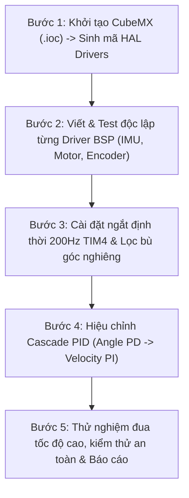

# CẤU TRÚC THƯ MỤC VÀ TỆP TIN DỰ ÁN — XE CÂN BẰNG 2 BÁNH
### (Two-Wheeled Self-Balancing Robot: Tự Đứng + Đua Tốc Độ Cao)

> [!NOTE]
> * **Dự án**: Đồ Án Hệ Thống Nhúng (DA_HTN)
> * **Nền tảng MCU**: STM32F411CEU6 (ARM Cortex-M4F, 100MHz, FPU)
> * **Căn cứ thiết kế**: Bám sát toàn diện các nguyên lý kỹ thuật, bảng BOM, thuật toán Cascade PID 2 vòng, quy hoạch Timer và 6 giai đoạn triển khai tại [Roadmap_Xe_Can_Bang_2_Banh_Chuan_Hoa.md](file:///d:/DA_HTN/Roadmap_Xe_Can_Bang_2_Banh_Chuan_Hoa.md).

---

## 1. TỔNG QUAN KIẾN TRÚC HỆ THỐNG

Để đáp ứng được yêu cầu khắt khe của xe cân bằng kết hợp **đua tốc độ cao** (vòng lặp điều khiển thời gian thực **200Hz / 5ms**, giảm thiểu độ trễ, triệt tiêu nhiễu EMI từ động cơ lên IMU, chống tích lũy sai số Integral Windup, cơ chế an toàn ngắt khẩn cấp khi ngã), cấu trúc thư mục của đồ án được module hóa thành **5 phân hệ chính**:

```
DA_HTN/
├── 📁 01_Firmware/          # Toàn bộ mã nguồn C/C++ nhúng cho STM32F411CEU6
├── 📁 02_Hardware/          # Thiết kế mạch nguyên lý, Layout PCB, Schematics, BOM
├── 📁 03_Mechanical/        # Bản vẽ CAD 2D/3D khung xe 2 tầng, gá chống rung IMU
├── 📁 04_Tools_Telemetry/   # Script Python/GUI giao tiếp Bluetooth, vẽ đồ thị & Tune PID
├── 📁 05_Docs_Reports/      # Báo cáo đồ án, datasheet, nhật ký test 6 giai đoạn
├── 📄 Roadmap_Xe_Can_Bang_2_Banh_Chuan_Hoa.md # Tài liệu lộ trình gốc
└── 📄 Cau_Truc_Thu_Muc_Do_An.md               # Tài liệu này
```

---

## 2. SƠ ĐỒ CÂY CHI TIẾT (PROJECT TREE)

```text
d:/DA_HTN/
│
├── 📁 01_Firmware/                                # Mã nguồn vi điều khiển STM32F411
│   ├── 📄 .ioc                                    # File cấu hình STM32CubeMX
│   ├── 📁 Core/                                   # Mã nguồn lõi do CubeMX sinh & quản lý vòng đời
│   │   ├── 📁 Inc/
│   │   │   ├── 📄 main.h                          # Định nghĩa macro chân, xung nhịp
│   │   │   ├── 📄 stm32f4xx_hal_conf.h            # Cấu hình module HAL được bật
│   │   │   └── 📄 stm32f4xx_it.h                  # Khai báo hàm xử lý ngắt
│   │   └── 📁 Src/
│   │       ├── 📄 main.c                          # Điểm khởi tạo hệ thống và vòng lặp nền
│   │       ├── 📄 stm32f4xx_hal_msp.c             # Khởi tạo ngoại vi cấp thấp (GPIO, Clock)
│   │       └── 📄 stm32f4xx_it.c                  # Định tuyến ngắt (TIM4 200Hz, USART, EXTI)
│   │
│   ├── 📁 Drivers/                                # Thư viện phần cứng của hãng ST
│   │   ├── 📁 CMSIS/                              # ARM Cortex-M4 Core & DSP math headers
│   │   └── 📁 STM32F4xx_HAL_Driver/               # Thư viện STM32 HAL chính thức
│   │
│   ├── 📁 BSP/                                    # Board Support Package (Driver ngoại vi trên xe)
│   │   ├── 📁 IMU/                                # Phân hệ cảm biến quán tính
│   │   │   ├── 📄 icm20602.h                      # Định nghĩa thanh ghi & cấu hình dải đo ICM-20602
│   │   │   └── 📄 icm20602.c                      # Đọc Accel/Gyro qua SPI/I2C, tự test, đo nhiệt độ
│   │   ├── 📁 Motor/                              # Phân hệ điều khiển công suất động cơ
│   │   │   ├── 📄 a4950_motor.h                   # Giao diện điều khiển động cơ Dual A4950
│   │   │   └── 📄 a4950_motor.c                   # Điều chế PWM 20kHz (TIM1), đảo chiều, hãm phanh
│   │   ├── 📁 Encoder/                            # Phân hệ đo vận tốc & vị trí bánh xe
│   │   │   ├── 📄 encoder.h                       # Khai báo cấu trúc đọc Encoder TI12
│   │   │   └── 📄 encoder.c                       # Đọc TIM2/TIM3, tính RPM, xử lý tràn bộ đếm
│   │   ├── 📁 Wireless/                           # Phân hệ giao tiếp không dây
│   │   │   ├── 📄 bluetooth.h                     # Cấu hình UART DMA, buffer vòng (Ring Buffer)
│   │   │   └── 📄 bluetooth.c                     # Nhận chuỗi lệnh AT, parse lệnh điều khiển
│   │   └── 📁 Power/                              # Phân hệ giám sát nguồn & cảnh báo
│   │       ├── 📄 battery_monitor.h               # Định nghĩa ngưỡng điện áp Pin 3S, còi Buzzer
│   │       └── 📄 battery_monitor.c               # Đọc ADC + DMA điện áp pin qua cầu chia áp
│   │
│   ├── 📁 Control/                                # Phân hệ thuật toán điều khiển trọng tâm
│   │   ├── 📁 Filters/                            # Bộ lọc ước lượng góc nghiêng
│   │   │   ├── 📄 complementary_filter.h          # Header bộ lọc bù (Alpha = 0.96 - 0.98)
│   │   │   ├── 📄 complementary_filter.c          # Triển khai lọc bù góc nghiêng 200Hz
│   │   │   ├── 📄 kalman_filter.h                 # Header bộ lọc Kalman 1 trục (tùy chọn FPU)
│   │   │   └── 📄 kalman_filter.c                 # Thuật toán Kalman Filter tối ưu hóa Cortex-M4F
│   │   ├── 📁 PID/                                # Bộ điều khiển PID cơ sở
│   │   │   ├── 📄 pid.h                           # Struct PID, Clamp Output, Anti-windup
│   │   │   └── 📄 pid.c                           # Hàm tính toán PID, Reset tích phân
│   │   ├── 📁 Cascade/                            # Bộ điều khiển Cascade 2 vòng lồng nhau
│   │   │   ├── 📄 cascade_controller.h            # Giao diện Cascade PID + Vi sai lái rẽ
│   │   │   └── 📄 cascade_controller.c            # Vòng Angle (PD 200Hz) + Vòng Speed (PI)
│   │   └── 📁 Safety/                             # Hệ thống bảo vệ an toàn chủ động
│   │       ├── 📄 safety_guard.h                  # Ngưỡng ngã (|angle| > 45°), kẹt động cơ
│   │       └── 📄 safety_guard.c                  # Tự động ngắt PWM khẩn cấp, bảo vệ phần cứng
│   │
│   ├── 📁 App/                                    # Tầng ứng dụng logic & trạng thái
│   │   ├── 📄 app_main.h                          # Điểm vào ứng dụng người dùng
│   │   ├── 📄 app_main.c                          # Quản lý FSM (State Machine): IDLE, RUN, FAIL...
│   │   ├── 📄 telemetry.h                         # Định nghĩa gói tin truyền thông Telemetry
│   │   ├── 📄 telemetry.c                         # Đóng gói góc nghiêng, tốc độ, PWM gửi lên PC/App
│   │   ├── 📄 remote_cmd.h                        # Giao thức lệnh điều khiển & Tune tham số
│   │   └── 📄 remote_cmd.c                        # Parser lệnh: chỉnh Kp, Kd, Ki, tốc độ, bẻ lái
│   │
│   └── 📁 Config/                                 # Cấu hình tham số hệ thống
│       ├── 📄 robot_config.h                      # Thông số vật lý: bán kính bánh, tỉ số truyền, PPR
│       └── 📄 pinout_config.h                     # Mapping chân GPIO, kênh Timer, ADC
│
├── 📁 02_Hardware/                                # Hồ sơ thiết kế điện & điện tử
│   ├── 📁 Schematics/                             # Sơ đồ nguyên lý mạch điện
│   │   ├── 📄 Balance_Bot_MainBoard.pdf           # Bản in PDF sơ đồ nguyên lý hoàn chỉnh
│   │   └── 📁 Altium_Or_KiCad_Project/            # File thiết kế gốc (Altium / KiCad / EasyEDA)
│   ├── 📁 Layout_PCB/                             # Thiết kế bo mạch in
│   │   ├── 📁 Gerbers/                            # File Gerber sẵn sàng gửi xưởng gia công
│   │   └── 📄 Layout_Rules_StarGround.md          # Hướng dẫn Star-Grounding & cách ly PWM 20kHz
│   ├── 📁 Pinout/
│   │   ├── 📄 STM32F411_Pinout_Mapping.xlsx       # Bảng phân bổ chân chi tiết (Timer, SPI, UART, ADC)
│   │   └── 📄 Pinout_Diagram.png                  # Ảnh sơ đồ nối dây nhanh cho việc lắp ráp
│   └── 📁 BOM/
│       ├── 📄 BOM_Chi_Tiet_Linh_Kien.xlsx         # Bảng BOM chuẩn hóa (số lượng, mã đặt hàng, giá)
│       └── 📄 VREF_A4950_Calculation.xlsx         # Bảng tính toán điện trở chia áp set dòng VREF
│
├── 📁 03_Mechanical/                              # Hồ sơ thiết kế cơ khí & kết cấu
│   ├── 📁 2D_Laser_Cutting/                       # Bản vẽ gia công cắt Laser
│   │   ├── 📄 Base_Plate_Tier1.dxf                # Tầng 1: Gá động cơ GA25, pin LiPo 3S hạ trọng tâm
│   │   ├── 📄 Top_Plate_Tier2.dxf                 # Tầng 2: Bo mạch STM32, Driver A4950, Buck XL4015
│   │   └── 📄 Laser_Cutting_Guide.md              # Ghi chú độ dày mica/phíp (3mm) và dung sai lỗ ốc
│   ├── 📁 3D_Models/                              # Thiết kế in 3D các phụ kiện phụ trợ
│   │   ├── 📄 IMU_Vibration_Damper_Mount.stl      # Khay chống rung IMU (kết hợp đệm xốp FPV)
│   │   ├── 📄 GA25_Motor_Bracket_Strengthener.stl # Ngàm trợ lực cố định động cơ chống rơ trục D
│   │   ├── 📄 HC05_Mount.stl                      # Khay cài module Bluetooth
│   │   └── 📄 Robot_Assembly_Full.step            # File 3D lắp ráp tổng thể (STEP)
│   └── 📁 CoG_Analysis/                           # Phân tích trọng tâm
│       └── 📄 Center_Of_Gravity_Report.md         # Báo cáo tối ưu độ cao trọng tâm cho xe đua
│
├── 📁 04_Tools_Telemetry/                         # Bộ công cụ phần mềm bổ trợ & Kiểm thử
│   ├── 📁 Python_Scripts/                         # Script Python cho PC debug qua Bluetooth
│   │   ├── 📄 requirements.txt                    # Danh sách thư viện: pyserial, matplotlib, pyqtgraph
│   │   ├── 📄 telemetry_receiver.py               # Nhận dữ liệu thời gian thực và xuất file CSV
│   │   ├── 📄 real_time_plotter.py                # Giao diện đồ thị thời gian thực (Angle vs Setpoint)
│   │   └── 📄 wireless_pid_tuner.py               # Giao diện gửi gói tin tinh chỉnh Kp, Ki, Kd live
│   ├── 📁 VOFA_Config/                            # Cấu hình phần mềm đồ thị VOFA+ (khuyến nghị)
│   │   ├── 📄 balancing_telemetry.vofa            # Template giao diện theo dõi góc, PWM, dòng tải
│   │   └── 📄 protocol_definition.txt             # Định dạng chuỗi FireWater / JustFloat
│   └── 📁 Calibration/
│       ├── 📄 encoder_ppr_calibration.py          # Script hỗ trợ đo đếm số xung thực tế trục bánh xe
│       └── 📄 imu_offset_calibration.py           # Script thống kê tính toán Gyro/Accel offset
│
├── 📁 05_Docs_Reports/                            # Tài liệu học thuật & Báo cáo kỹ thuật
│   ├── 📁 Datasheets/                             # Datasheet gốc tra cứu nhanh
│   │   ├── 📄 STM32F411CEU6_Datasheet.pdf
│   │   ├── 📄 Allegro_A4950_Motor_Driver.pdf
│   │   ├── 📄 ICM_20602_Datasheet.pdf
│   │   └── 📄 GA25_370_Geared_Motor.pdf
│   ├── 📁 Testing_Checklists/                     # Nhật ký kiểm thử qua 6 giai đoạn
│   │   ├── 📄 Phase1_Mechanical_Backlash_Check.md # Kiểm tra độ rơ cơ khí & khớp nối trục D
│   │   ├── 📄 Phase2_Electrical_Power_Check.md    # Đo sụt áp Buck XL4015 dưới tải, Timer PWM
│   │   ├── 📄 Phase3_Sensor_Filter_Noise_Test.md  # Kiểm tra độ nhiễu IMU khi motor chạy PWM 20kHz
│   │   ├── 📄 Phase4_Cascade_PID_Tuning_Log.md    # Nhật ký thông số PID (Inner PD -> Outer PI)
│   │   ├── 📄 Phase5_Racing_Differential_Test.md  # Kiểm tra vào cua tốc độ cao, góc ±15°
│   │   └── 📄 Phase6_Safety_Fall_Detection_Log.md # Kiểm tra cắt PWM khi ngã > 45° và pin yếu
│   ├── 📁 Academic_Reports/                       # Báo cáo đồ án phục vụ bảo vệ môn học
│   │   ├── 📄 Bao_Cao_Do_An_He_Thong_Nhung.docx   # Báo cáo thuyết minh đồ án hoàn chỉnh
│   │   ├── 📄 Slide_Bao_Ve_Do_An.pptx             # Slide thuyết trình trước hội đồng
│   │   └── 📁 Demo_Videos_And_Images/             # Video xe tự đứng, xe đua, hình ảnh thực tế
│   └── 📁 References/                             # Tài liệu nghiên cứu mở rộng
│       ├── 📄 Balanduino_TKJ_Electronics.pdf
│       └── 📄 High_Speed_Balancing_Elexperiment.pdf
│
├── 📄 Roadmap_Xe_Can_Bang_2_Banh_Chuan_Hoa.md     # Tài liệu lộ trình kỹ thuật chuẩn hóa
└── 📄 Cau_Truc_Thu_Muc_Do_An.md                   # Mô tả cấu trúc thư mục này
```

---

## 3. MÔ TẢ TRÁCH NHIỆM CHI TIẾT CỦA CÁC MODULE MÃ NGUỒN (01_Firmware)

### 3.1. Phân tầng kiến trúc phần mềm

Mã nguồn nhúng tuân thủ nguyên tắc **Layered Architecture (Kiến trúc phân tầng)** nhằm cô lập phần cứng, thuật toán và ứng dụng:

```
┌───────────────────────────────────────────────────────────────────┐
│                        TẦNG 4: APPLICATION                        │
│   (app_main: Finite State Machine, telemetry, remote_cmd)         │
├───────────────────────────────────────────────────────────────────┤
│                     TẦNG 3: CONTROL & ALGORITHM                   │
│   (Cascade PID, Complementary Filter, Safety Guard, Differential) │
├───────────────────────────────────────────────────────────────────┤
│                  TẦNG 2: BOARD SUPPORT PACKAGE (BSP)               │
│   (icm20602, a4950_motor, encoder, bluetooth, battery_monitor)   │
├───────────────────────────────────────────────────────────────────┤
│                 TẦNG 1: HARDWARE ABSTRACTION LAYER                │
│   (STM32F4xx HAL Driver, CMSIS, Core Startup & Interrupts)       │
└───────────────────────────────────────────────────────────────────┘
```

---

### 3.2. Chi tiết từng file trong `01_Firmware/`

#### A. Thư mục `Core/` & `Config/`

*   [`Core/Src/stm32f4xx_it.c`](file:///d:/DA_HTN/01_Firmware/Core/Src/stm32f4xx_it.c):
    *   Nơi đặt trình phục vụ ngắt `TIM4_IRQHandler()` chạy định thời **chính xác 200Hz (chu kỳ 5ms)**. Mọi tác vụ khắt khe về thời gian (đọc IMU, chạy Filter, tính Cascade PID, xuất PWM ra A4950) đều được điều phối từ ngắt này.
    *   Trình phục vụ ngắt `USARTx_IRQHandler()` xử lý dữ liệu truyền/nhận từ module Bluetooth bằng DMA hoặc Ring Buffer để không làm trễ ngắt 200Hz.
*   [`Config/robot_config.h`](file:///d:/DA_HTN/01_Firmware/Config/robot_config.h):
    *   Chứa hằng số vật lý: Chu vi bánh xe `WHEEL_CIRCUMFERENCE_MM`, tỷ số truyền hộp số `GEAR_RATIO (~30)`, số xung encoder `ENCODER_PPR (x4 mode)`, khoảng cách 2 bánh xe `WHEEL_BASE_MM`.
    *   Hạn mức an toàn: `MAX_ANGLE_SAFE = 45.0f`, `MAX_PWM_DUTY = 1000`, `BATTERY_LOW_VOLTAGE_MV = 9900`.
*   [`Config/pinout_config.h`](file:///d:/DA_HTN/01_Firmware/Config/pinout_config.h):
    *   Bảng ánh xạ chân cứng:
        *   `TIM1_CH1 / CH2 / CH3 / CH4` cho A4950 (IN1, IN2, IN3, IN4).
        *   `TIM2_CH1 / CH2` (PA0, PA1) cho Encoder Trái.
        *   `TIM3_CH1 / CH2` (PA6, PA7) cho Encoder Phải.
        *   `SPI1` hoặc `I2C1` (PB6, PB7) cho ICM-20602.
        *   `USART1` (PA9, PA10) cho Bluetooth HC-05/JDY-31 (115200 baud).
        *   `ADC1_IN0` cho cầu chia áp Pin LiPo 3S.
        *   `GPIO` cho còi Buzzer cảnh báo pin và LED báo trạng thái.

#### B. Thư mục `BSP/` (Board Support Package)

*   [`BSP/IMU/icm20602.c / .h`](file:///d:/DA_HTN/01_Firmware/BSP/IMU/icm20602.c):
    *   Cấu hình thanh ghi ICM-20602: thang đo Con quay hồi chuyển (Gyro) `±2000 dps`, thang đo Gia tốc kế (Accel) `±8g`, tần số lấy mẫu ngắt trong cảm biến.
    *   Cung cấp hàm `ICM20602_ReadRaw()`, `ICM20602_CalibrateGyroOffset()` (lấy trung bình 500 mẫu khi đứng yên để loại trừ trôi nhiệt/bias).
*   [`BSP/Motor/a4950_motor.c / .h`](file:///d:/DA_HTN/01_Firmware/BSP/Motor/a4950_motor.c):
    *   Cấu hình PWM 20kHz (trên ngưỡng nghe của tai người, giảm tiếng rít động cơ và tối ưu đáp ứng dòng của A4950).
    *   Cung cấp hàm `Motor_SetSpeed(int16_t left_pwm, int16_t right_pwm)` với cơ chế kẹp giá trị (clamping) từ `-1000` đến `+1000`.
    *   Hỗ trợ chế độ phanh cưỡng bức (Brake Mode) khi kích hoạt ngắt an toàn.
*   [`BSP/Encoder/encoder.c / .h`](file:///d:/DA_HTN/01_Firmware/BSP/Encoder/encoder.c):
    *   Cấu hình chế độ đếm cạnh kép `TIM_ENCODERMODE_TI12` (x4 độ phân giải) giúp tăng độ mịn khi xe chạy ở dải tốc độ thấp.
    *   Tính toán vận tốc góc của từng bánh xe theo chu kỳ 5ms: `v = (delta_pulse / dt) * mm_per_pulse`.
*   [`BSP/Wireless/bluetooth.c / .h`](file:///d:/DA_HTN/01_Firmware/BSP/Wireless/bluetooth.c):
    *   Nhận dữ liệu theo cơ chế non-blocking sử dụng DMA + IDLE line interrupt hoặc Ring Buffer.
    *   Cấu hình sẵn baudrate **115200 bps** để đảm bảo tốc độ truyền telemetry trực tiếp mà không nghẽn đường truyền UART.
*   [`BSP/Power/battery_monitor.c / .h`](file:///d:/DA_HTN/01_Firmware/BSP/Power/battery_monitor.c):
    *   Đọc ADC qua DMA kết hợp bộ lọc trung bình trượt (Moving Average Filter 20 mẫu) để triệt tiêu nhiễu sụt áp tức thời khi động cơ tăng tốc đột ngột.

#### C. Thư mục `Control/` (Phân hệ điều khiển trọng tâm)

*   [`Control/Filters/complementary_filter.c / .h`](file:///d:/DA_HTN/01_Firmware/Control/Filters/complementary_filter.c):
    *   Triển khai công thức bộ lọc bù chuẩn:
        $$\theta = \alpha \cdot (\theta_{prev} + \omega_{gyro} \cdot \Delta t) + (1 - \alpha) \cdot \theta_{accel}$$
    *   `\alpha` cấu hình mặc định từ **0.96 đến 0.98**. Tính toán siêu nhẹ, không trễ, đáp ứng hoàn hảo tần số 200Hz.
*   [`Control/Filters/kalman_filter.c / .h`](file:///d:/DA_HTN/01_Firmware/Control/Filters/kalman_filter.c):
    *   Triển khai bộ lọc Kalman 1 chiều tận dụng phần cứng tính toán dấu phẩy động **ARM Cortex-M4F FPU**, dùng khi cần so sánh hiệu năng hoặc chạy trên sân nhám rung động mạnh.
*   [`Control/PID/pid.c / .h`](file:///d:/DA_HTN/01_Firmware/Control/PID/pid.c):
    *   Cấu trúc dữ liệu PID độc lập hỗ trợ:
        *   **Giới hạn ngõ ra tích phân (Anti-windup clamping)**: Ngăn ngừa hiện tượng xe bị giữ nghiêng lâu rồi "vọt" đi mất kiểm soát khi thả tay.
        *   **Lọc thông thấp đạo hàm (Derivative Low-pass Filter)**: Tránh khuếch đại nhiễu gai của gyro.
*   [`Control/Cascade/cascade_controller.c / .h`](file:///d:/DA_HTN/01_Firmware/Control/Cascade/cascade_controller.c):
    *   **Vòng trong (Angle Loop - PD)**: Chạy mỗi 5ms (200Hz).
        *   *Input*: Góc nghiêng thực tế (từ Complementary Filter).
        *   *Setpoint*: Góc mục tiêu được cấp từ Vòng ngoài (Velocity Loop).
        *   *Output*: Giá trị PWM trực tiếp cho A4950.
    *   **Vòng ngoài (Velocity Loop - PI)**:
        *   *Input*: Vận tốc trung bình 2 bánh từ Encoder.
        *   *Setpoint*: Vận tốc mong muốn (bằng 0 khi đứng yên; khác 0 khi đua/tiến/lùi).
        *   *Output*: **Angle Setpoint Offset** (tạo góc ngả thân xe ra trước/sau để sinh gia tốc).
    *   **Bộ bù vi sai lái (Differential Steering Authority)**:
        *   Tự động giảm biên độ bù lái $PWM_{diff}$ khi vận tốc xe tăng cao, ngăn ngừa lật ngang khi cua gấp ở chế độ đua.
*   [`Control/Safety/safety_guard.c / .h`](file:///d:/DA_HTN/01_Firmware/Control/Safety/safety_guard.c):
    *   **Giám sát góc**: Nếu $|\theta| > 45^{\circ}$ $\rightarrow$ ngắt tức thời cả 4 kênh PWM về 0, chuyển trạng thái hệ thống sang `STATE_FALL_PROTECT`.
    *   **Giám sát pin**: Nếu điện áp 3S dưới 9.9V $\rightarrow$ kích hoạt còi Buzzer ngắt quãng, giảm giới hạn tốc độ tối đa để bảo vệ cell pin.

#### D. Thư mục `App/` (Ứng dụng và Quản lý)

*   [`App/app_main.c / .h`](file:///d:/DA_HTN/01_Firmware/App/app_main.c):
    *   Máy trạng thái hữu hạn (FSM):
        *   `STATE_INIT`: Khởi tạo ngoại vi, tự kiểm tra phần cứng.
        *   `STATE_CALIBRATING`: Lấy mẫu tĩnh IMU trong 2 giây (giữ yên xe).
        *   `STATE_BALANCING`: Xe tự đứng tại chỗ (Angle Loop + Zero Velocity Loop).
        *   `STATE_RACING`: Chế độ đua tốc độ cao (mở rộng góc nghiêng cho phép lên $\pm 15^{\circ}$, nhận lệnh điều hướng không dây).
        *   `STATE_EMERGENCY_STOP`: Dừng khẩn cấp khi ngã hoặc có lệnh từ người dùng.
*   [`App/telemetry.c / .h`](file:///d:/DA_HTN/01_Firmware/App/telemetry.c):
    *   Đóng gói frame truyền theo định dạng Text/CSV hoặc FireWater của VOFA+:
        *   Ví dụ: `float pitch, setpoint_pitch, velocity, pwm_left, pwm_right, vbat;`
*   [`App/remote_cmd.c / .h`](file:///d:/DA_HTN/01_Firmware/App/remote_cmd.c):
    *   Phân tích cú pháp lệnh từ máy tính / điện thoại qua Bluetooth mà không cần dừng xe hoặc nạp lại firmware:
        *   `$KP1=35.5\n`: Tinh chỉnh Kp vòng góc.
        *   `$KD1=1.8\n`: Tinh chỉnh Kd vòng góc.
        *   `$SPEED=150\n`: Đặt tốc độ tiến/lùi.
        *   `$STEER=30\n`: Đặt góc rẽ.

---

## 4. BẢNG ÁNH XẠ CHỨC NĂNG THEO 6 GIAI ĐOẠN ROADMAP

Cấu trúc thư mục được thiết kế tương ứng trực tiếp với 6 giai đoạn thi công tại [Roadmap_Xe_Can_Bang_2_Banh_Chuan_Hoa.md](file:///d:/DA_HTN/Roadmap_Xe_Can_Bang_2_Banh_Chuan_Hoa.md):

| Giai đoạn Roadmap | Hạng mục công việc kỹ thuật | Vị trí File / Thư mục tương ứng phụ trách |
| :--- | :--- | :--- |
| **Giai đoạn 1: Cơ khí & Trọng tâm** | • Khung 2 tầng phíp/mica, hạ thấp trọng tâm cho xe đua.<br>• Triệt tiêu rơ (backlash) trục D 4mm.<br>• Cân đối đồng trục 2 bánh trái - phải. | `03_Mechanical/2D_Laser_Cutting/`<br>`03_Mechanical/3D_Models/`<br>`05_Docs_Reports/Testing_Checklists/Phase1_Mechanical_Backlash_Check.md` |
| **Giai đoạn 2: Hệ thống Điện & Timer** | • Quy hoạch Timer (TIM1 PWM, TIM2/TIM3 Encoder, TIM4 200Hz).<br>• Set dòng VREF trên driver Dual A4950.<br>• Cách ly Star-Grounding, lọc nguồn Buck XL4015. | `01_Firmware/Core/Src/stm32f4xx_it.c`<br>`01_Firmware/BSP/Motor/a4950_motor.c`<br>`02_Hardware/Layout_PCB/Layout_Rules_StarGround.md`<br>`02_Hardware/BOM/VREF_A4950_Calculation.xlsx` |
| **Giai đoạn 3: Tín hiệu & Lọc góc** | • Ngắt định thời 200Hz (5ms).<br>• Bộ lọc bù (Complementary Filter $\alpha = 0.96 - 0.98$).<br>• Đo offset IMU, chống rung xốp cho ICM-20602. | `01_Firmware/Control/Filters/complementary_filter.c`<br>`01_Firmware/BSP/IMU/icm20602.c`<br>`04_Tools_Telemetry/Calibration/imu_offset_calibration.py` |
| **Giai đoạn 4: Thuật toán Cascade PID** | • Tune vòng trong Angle (PD trước, dập dao động).<br>• Bật vòng ngoài Velocity (PI), tạo angle offset.<br>• Chống Integral Windup (Clamping).<br>• Tune PID không dây qua Bluetooth 115200. | `01_Firmware/Control/PID/pid.c`<br>`01_Firmware/Control/Cascade/cascade_controller.c`<br>`01_Firmware/App/remote_cmd.c`<br>`04_Tools_Telemetry/Python_Scripts/wireless_pid_tuner.py` |
| **Giai đoạn 5: Tối ưu Đua & Không dây** | • Điều khiển vi sai bánh (giảm bù lái ở tốc độ cao).<br>• Mở rộng góc nghiêng cho phép ($\pm 5^{\circ} \rightarrow \pm 15^{\circ}$).<br>• Giao diện điều khiển từ xa qua Bluetooth. | `01_Firmware/Control/Cascade/cascade_controller.c`<br>`01_Firmware/App/app_main.c`<br>`04_Tools_Telemetry/Python_Scripts/real_time_plotter.py` |
| **Giai đoạn 6: Kiểm thử & An toàn** | • Cơ chế phát hiện ngã (Fall detection $> 45^{\circ}$).<br>• Cảnh báo pin yếu (Low Voltage Cutoff $< 9.9V$).<br>• Kiểm tra nhiễu EMI giữa dây motor và bus I2C/SPI.<br>• Test trên các bề mặt sàn, log dữ liệu offline. | `01_Firmware/Control/Safety/safety_guard.c`<br>`01_Firmware/BSP/Power/battery_monitor.c`<br>`04_Tools_Telemetry/Python_Scripts/telemetry_receiver.py`<br>`05_Docs_Reports/Testing_Checklists/` |

---

## 5. ĐẶC TẢ GIAO THỨC TRUYỀN THÔNG VÀ DỮ LIỆU (TELEMETRY & CONTROL)

Nhằm phục vụ quá trình hiệu chỉnh PID và theo dõi động học của xe khi đang chạy tốc độ cao, hệ thống quy định 2 kênh truyền thông qua UART Bluetooth (**115200 baud, 8N1**):

### 5.1. Gói tin Telemetry gửi lên máy tính (Downlink - 50Hz)

Gửi dạng chuỗi định dạng Text/CSV hoặc binary (tương thích phần mềm đồ thị VOFA+ hoặc script Python):
```text
$TEL,pitch,setpoint_pitch,velocity,pwm_L,pwm_R,vbat\r\n
```

*   `pitch`: Góc nghiêng hiện tại (độ, float).
*   `setpoint_pitch`: Góc nghiêng mục tiêu do vòng ngoài sinh ra (độ, float).
*   `velocity`: Vận tốc trung bình đo được từ 2 encoder (mm/s, float).
*   `pwm_L`, `pwm_R`: Duty cycle cấp cho 2 động cơ (-1000 đến +1000, int16).
*   `vbat`: Điện áp tức thời của bộ pin 3S (V, float).

### 5.2. Gói tin điều khiển & Tune PID từ máy tính gửi xuống (Uplink)

Các lệnh dạng ký tự ASCII kết thúc bằng ký tự xuống dòng `\n`:
*   **Cài đặt hệ số góc**: `$KP1=35.0\n`, `$KD1=1.5\n`, `$KI1=0.0\n`
*   **Cài đặt hệ số vận tốc**: `$KP2=2.0\n`, `$KI2=0.05\n`
*   **Lệnh di chuyển**: `$MOVE,speed,turn\n` (với `speed` từ -100 đến 100%, `turn` từ -100 đến 100%).
*   **Lệnh an toàn**: `$STOP\n` (ngắt khẩn cấp ngay lập tức).
*   **Lệnh reset/lấy gốc**: `$CALIB\n` (lấy lại offset cân bằng IMU).

---

## 6. QUY TRÌNH SỬ DỤNG VÀ PHÁT TRIỂN TIẾP THEO



1.  **Khởi tạo dự án CubeMX**: Mở `01_Firmware/.ioc`, sinh mã khung HAL chuẩn bị thư mục `Core/` và `Drivers/`.
2.  **Triển khai tầng BSP**: Bắt đầu bằng việc kiểm tra độc lập từng module tại `01_Firmware/BSP/` (đo xung encoder, phát xung PWM motor, giao tiếp đọc mẫu thô từ ICM-20602).
3.  **Cài đặt ngắt 200Hz và Lọc bù**: Đặt logic tại `Control/Filters/` và kích hoạt trong ngắt `TIM4` tại `stm32f4xx_it.c`.
4.  **Hiệu chỉnh PID theo thứ tự**:
    *   Chạy script `04_Tools_Telemetry/Python_Scripts/wireless_pid_tuner.py`.
    *   Tune `Kp1` rồi đến `Kd1` của vòng trong (Angle) để xe tự đứng vững.
    *   Kích hoạt `Kp2` và `Ki2` của vòng ngoài (Velocity) để triệt tiêu trôi và tạo gia tốc đua.
5.  **Đánh giá và Hoàn thiện**: Ghi chép dữ liệu vào thư mục `05_Docs_Reports/Testing_Checklists/` phục vụ viết báo cáo đồ án và làm slide thuyết minh.
