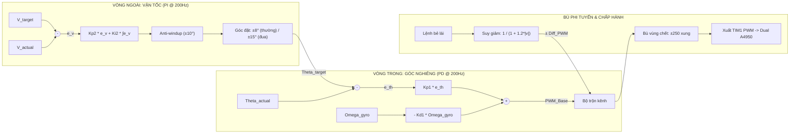
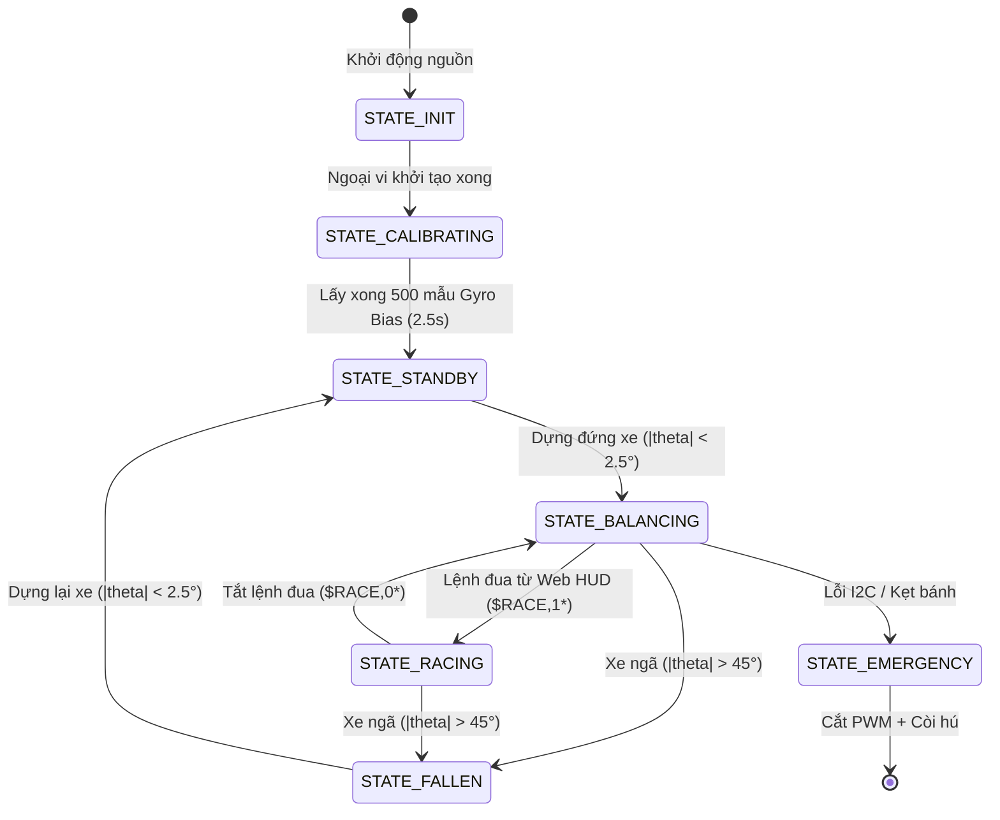

# THUẬT TOÁN ĐIỀU KHIỂN & MÃ NGUỒN — XE CÂN BẰNG 2 BÁNH

Tài liệu đặc tả mô hình toán học động lực học con lắc ngược (TWIP), bộ lọc bù góc nghiêng, giải thuật Cascade PID 2 vòng và mã nguồn C thực thi thời gian thực 200Hz.

---

## 1. MÔ HÌNH ĐỘNG LỰC HỌC CON LẮC NGƯỢC (TWIP)

Hệ thống xe cân bằng 2 bánh là hệ thống phi tuyến thiếu cơ cấu chấp hành (Underactuated System): 2 động cơ chỉ tác động mô-men lực vào 2 bánh xe nhưng cần kiểm soát đồng thời cả vị trí bánh xe $x$ lẫn góc nghiêng thân xe $\theta$.

```
         ^ y (Trục thẳng đứng)
         |         /  (Thân xe ngả góc theta)
         |        * Trọng tâm thân xe (Khối lượng M, chiều dài L)
         |       /
         |      /  Góc nghiêng theta (theta > 0: ngả về trước)
         |     /
   [O]---(O)------> x (Vị trí xe tịnh tiến, bánh bán kính R)
```

### Cơ chế động học khi đua và bứt tốc:
Khi xe muốn tăng tốc về phía trước với gia tốc tịnh tiến $a_x = \ddot{x} > 0$, tổng mô-men lực quay quanh trục bánh xe phải cân bằng giữa lực quán tính $M \cdot a_x$ và trọng lực $M \cdot g$:
$$M \cdot g \cdot L \sin\theta - M \cdot a_x \cdot L \cos\theta = 0 \implies \tan\theta = \frac{a_x}{g} \implies \theta_{\text{target}} \approx \arctan\left(\frac{a_x}{g}\right)$$

> **Kết luận cốt lõi**: Muốn xe chạy nhanh, xe **bắt buộc phải chủ động ngả thân về phía trước một góc $\theta_{\text{target}} > 0$**. 
> Ngõ ra của vòng vận tốc (Velocity Loop) chính là **Góc nghiêng đặt $\theta_{\text{target}}$**, không phải là PWM trực tiếp.

---

## 2. ƯỚC LƯỢNG GÓC NGHIÊNG BẰNG BỘ LỌC BÙ (COMPLEMENTARY FILTER)

Cảm biến Bosch BMI160 đo được 2 đại lượng bổ trợ cho nhau:
* **Gia tốc kế**: Góc đo tĩnh $\theta_{\text{acc}} = \arctan2(A_x, A_z) \times 57.2958^\circ$ (không trôi theo thời gian, nhưng nhạy cảm với rung động cơ học).
* **Con quay hồi chuyển**: Vận tốc góc ngã $\omega_{\text{gyro}} = G_y$ ($^\circ/s$, phản ứng tức thì không trễ, nhưng bị trôi tĩnh tích phân).

Phương trình sai phân rời rạc chạy ở chu kỳ $T_s = 5.0\text{ ms}$ ($\Delta t = 0.005\text{ s}$):
$$\theta[k] = 0.98 \times \left(\theta[k-1] + \omega_{\text{gyro}}[k] \times \Delta t\right) + 0.02 \times \theta_{\text{acc}}[k]$$

Hệ số $\alpha = 0.98$ lấy $98\%$ độ nhạy tức thời của Gyro và $2\%$ độ ổn định dài hạn của Accel, triệt tiêu hoàn toàn độ trễ và độ trôi góc.

---

## 3. CẤU TRÚC CASCADE PID 2 VÒNG LỒNG NHAU



### 3.1. Vòng Trong — Điều khiển Góc nghiêng (Angle Loop PD)
Giữ vững thăng bằng cho thân xe chống lại trọng lực:
$$\text{PWM}_{\text{base}}[k] = K_{p1} \cdot (\theta_{\text{target}}[k] - \theta_{\text{actual}}[k]) - K_{d1} \cdot \omega_{\text{gyro}}[k]$$

* **Khâu $K_{p1}$ (Lò xo xoắn ảo)**: Sinh mô-men phản kháng kéo ngược lại khi xe bị nghiêng.
* **Khâu $K_{d1}$ (Giảm chấn ảo)**: Dùng trực tiếp vận tốc góc $\omega_{\text{gyro}}$ từ cảm biến thay vì đạo hàm sai số để triệt tiêu hiện tượng *Derivative Kick* và khử nhiễu vi phân số.
* *Không dùng khâu $K_i$ ở vòng góc* để tránh trễ pha $90^\circ$ làm mất ổn định hệ con lắc ngược.

### 3.2. Vòng Ngoài — Điều khiển Vận tốc (Velocity Loop PI)
Đảm bảo xe chạy theo tốc độ mong muốn hoặc đứng yên tại chỗ không trôi:
$$e_v[k] = v_{\text{target}}[k] - v_{\text{actual}}[k]$$
$$I_v[k] = \text{Clamp}\left(I_v[k-1] + K_{i2} \cdot e_v[k] \cdot \Delta t, \ -10^\circ, \ +10^\circ\right)$$
$$\theta_{\text{target}}[k] = \text{Clamp}\left(K_{p2} \cdot e_v[k] + I_v[k], \ -\theta_{\max}, \ +\theta_{\max}\right)$$

* **Vai trò của khâu $I_v$**: Tự động học điểm cân bằng tĩnh thực tế ($\theta_{\text{trim}}$), bù trừ sai số trọng tâm cơ khí (lệch vị trí pin, dây điện) để xe đứng bất động tại chỗ.
* **Giới hạn góc nghiêng $\theta_{\max}$**:
  * Chế độ thường: $\theta_{\max} = \pm 8.0^\circ$.
  * Chế độ đua (Racing Mode): $\theta_{\max} = \pm 15.0^\circ$ (tạo gia tốc cực đại $a_x \approx 2.6\text{ m/s}^2$).

### 3.3. Bù Phi Tuyến Thực Tế
1. **Bù lái thích ứng theo vận tốc (Speed-Adaptive Steering)**:
   $$\Delta\text{PWM}_{\text{steer}} = \frac{\text{SteerCmd}}{1.0 + 1.2 \cdot |v_{\text{actual}}|}$$
   Khi xe đứng yên ($v \approx 0$): hệ số bằng $1.0 \to$ xoay tròn tại chỗ nhanh. Khi xe chạy nhanh: biên độ lái tự động thu nhỏ lại để vào cua mượt mà, không bị lật.
2. **Bù vùng chết ma sát hộp số (Deadband Compensation)**:
   $$u_{\text{out}} = 
   \begin{cases} 
   u + 250, & \text{khi } u > 1 \\
   u - 250, & \text{khi } u < -1 \\
   0, & \text{khi } -1 \le u \le 1
   \end{cases}$$
   Giúp động cơ GA25 vượt qua lực ma sát tĩnh của hộp số 1:30 ngay khi có sai số nhỏ.

---

## 4. MÁY TRẠNG THÁI HỆ THỐNG (FSM)



---

## 5. MÃ NGUỒN C HIỆN THỰC THỜI GIAN THỰC (200Hz)

Toàn bộ thuật toán được thực thi trong hàm `Robot_ControlLoop_200Hz()` tại file [`robot_fsm.c`](file:///d:/DA_HTN/Xe_Can_Bang/Core/Src/robot_fsm.c), được gọi từ ngắt cứng TIM4 trong [`main.c`](file:///d:/DA_HTN/Xe_Can_Bang/Core/Src/main.c):

```c
void Robot_ControlLoop_200Hz(void)
{
    /* 1. Đọc cảm biến Bosch BMI160 Burst 12 bytes qua I2C1 (< 350µs) */
    BMI160_Data_t imu;
    if (!BMI160_Read_All(&imu)) {
        s_robot.state = ROBOT_STATE_EMERGENCY;
        Motor_Stop();
        return;
    }

    /* 2. Lọc bù góc nghiêng Pitch & lấy Gyro rate */
    s_robot.pitch = Filter_Complementary_Update(imu.gy, imu.ax, imu.az, 0.005f);
    s_robot.gyro_rate = imu.gy;

    /* 3. Đọc Encoder & lọc vận tốc tịnh tiến LPF */
    Encoder_Update(0.005f);
    s_robot.v_actual = Encoder_GetAverageVelocity();

    /* 4. Nhận lệnh từ ESP32-S3 */
    ESP32_Command_t* cmd = ESP32_Comm_GetCommand();

    /* 5. Cắt an toàn khi ngã quá 45 độ */
    if (fabsf(s_robot.pitch) > 45.0f) {
        Motor_Stop();
        PID_Reset_Integral();
        s_robot.state = ROBOT_STATE_FALLEN;
        return;
    }

    /* 6. Tự động kích hoạt cân bằng khi dựng đứng xe (|pitch| < 2.5 độ) */
    if (s_robot.state == ROBOT_STATE_STANDBY || s_robot.state == ROBOT_STATE_FALLEN) {
        if (fabsf(s_robot.pitch) < 2.5f) {
            s_robot.state = cmd->is_racing ? ROBOT_STATE_RACING : ROBOT_STATE_BALANCING;
            PID_Reset_Integral();
            Encoder_Reset();
        } else {
            Motor_Stop();
            return;
        }
    }

    /* 7. Tính toán Cascade PID */
    if (s_robot.state == ROBOT_STATE_BALANCING || s_robot.state == ROBOT_STATE_RACING) {
        uint8_t is_race = (s_robot.state == ROBOT_STATE_RACING) ? 1 : 0;

        // Vòng ngoài PI: Vận tốc -> Theta_target
        float theta_target = PID_Velocity_Compute(cmd->v_target, s_robot.v_actual, is_race, 0.005f);

        // Vòng trong PD: Góc nghiêng -> Base PWM
        float pwm_base = PID_Angle_Compute(theta_target, s_robot.pitch, s_robot.gyro_rate);

        // Bù lái thích ứng vận tốc
        float steer_eff = PID_Adaptive_Steering(cmd->steer_cmd, s_robot.v_actual);

        // Trộn kênh 2 bánh & bù vùng chết ma sát hộp số
        int16_t out_l = PID_Apply_Deadband(pwm_base + steer_eff, MOTOR_DEADBAND, MOTOR_MAX_PWM);
        int16_t out_r = PID_Apply_Deadband(pwm_base - steer_eff, MOTOR_DEADBAND, MOTOR_MAX_PWM);

        // Xuất xung ra Driver Dual A4950
        Motor_SetDuty(out_l, out_r);
    }
}
```

### Phân tầng các file mã nguồn:
* **`Core/Inc` & `Core/Src`**:
  * `tim.c`, `i2c.c`, `usart.c`, `gpio.c`, `dma.c`: Tầng khởi tạo ngoại vi phần cứng (CubeMX sinh).
  * `motor.c/.h`: Điều khiển PWM 20kHz Driver A4950.
  * `encoder.c/.h`: Đếm xung Encoder và lọc vận tốc m/s.
  * `bmi160.c/.h`: Giao tiếp I2C đọc Burst dữ liệu IMU.
  * `filter.c/.h`: Giải thuật Complementary Filter.
  * `pid.c/.h`: Thuật toán Cascade PID 2 vòng + Bù phi tuyến.
  * `esp32_comm.c/.h`: Quản lý bộ đệm DMA nhận lệnh và phát Telemetry.
  * `buzzer_led.c/.h`: Điều khiển còi và LED chỉ thị.
  * `robot_fsm.c/.h`: Quản lý FSM và vòng lặp 200Hz.
  * `main.c`: Nhịp tim định thời và vòng lặp sự kiện nền.
