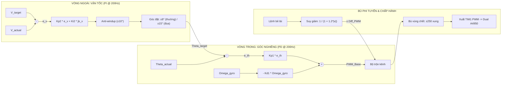
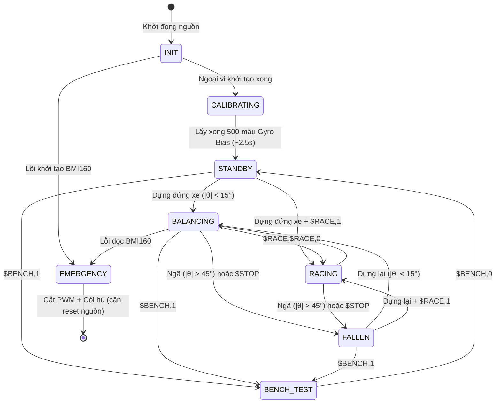

# THUẬT TOÁN ĐIỀU KHIỂN & MÃ NGUỒN — XE CÂN BẰNG 2 BÁNH (TWIP ROBOT)

> **Tài liệu hợp nhất** mô tả mô hình toán học con lắc ngược (TWIP), bộ lọc bù góc nghiêng,
> giải thuật Cascade PID 2 vòng, máy trạng thái FSM, mã nguồn C thời gian thực 200Hz và
> giao thức Telemetry/Data Logger.
> Nội dung đã được **đối chiếu và cập nhật đúng theo mã nguồn hiện tại** của đồ án
> (hợp nhất từ hai tài liệu thuật toán trước đây; bản `Mo_Ta_..._Tong_The` đã được gộp chung vào đây và xóa).

---

## 1. MÔ HÌNH ĐỘNG LỰC HỌC CON LẮC NGƯỢC (TWIP)

Hệ thống xe cân bằng 2 bánh là hệ thống phi tuyến thiếu cơ cấu chấp hành (Underactuated System):
2 động cơ chỉ tác động mô-men lực vào 2 bánh xe nhưng cần kiểm soát đồng thời cả vị trí bánh xe $x$
lẫn góc nghiêng thân xe $\theta$.

```
         ^ y (Trục thẳng đứng)
         |         /  (Thân xe ngả góc theta)
         |        * Trọng tâm thân xe (Khối lượng M, chiều dài L)
         |       /
         |      /  Góc nghiêng theta (theta > 0: ngả về trước)
         |     /
   [O]---(O)------> x (Vị trí xe tịnh tiến, bánh bán kính R)
```

### Cơ chế động học khi bứt tốc:

Khi xe muốn tăng tốc về phía trước với gia tốc tịnh tiến $a_x = \ddot{x} > 0$, tổng mô-men lực quay
quanh trục bánh xe phải cân bằng giữa lực quán tính $M \cdot a_x$ và trọng lực $M \cdot g$:

$$
M \cdot g \cdot L \sin\theta - M \cdot a_x \cdot L \cos\theta = 0
\implies \tan\theta = \frac{a_x}{g}
\implies \theta_{\text{target}} \approx \arctan\left(\frac{a_x}{g}\right)
$$

> **Kết luận cốt lõi**: Muốn xe chạy nhanh, xe **bắt buộc phải chủ động ngả thân về phía trước một góc $\theta_{\text{target}} > 0$**.
> Ngõ ra của vòng vận tốc (Velocity Loop) chính là **Góc nghiêng đặt $\theta_{\text{target}}$**, không phải là PWM trực tiếp.

---

## 2. ƯỚC LƯỢNG GÓC NGHIÊNG BẰNG BỘ LỌC BÙ (COMPLEMENTARY FILTER)

Cảm biến Bosch BMI160 đo được 2 đại lượng bổ trợ cho nhau:

* **Gia tốc kế**: Góc đo tĩnh $\theta_{\text{acc}} = \arctan2(A_x, A_z) \times 57.2958^\circ$
  (không trôi theo thời gian, nhưng nhạy cảm với rung động cơ học).
* **Con quay hồi chuyển**: Vận tốc góc ngã $\omega_{\text{gyro}} = G_y$ ($^\circ/s$,
  phản ứng tức thì không trễ, nhưng bị trôi tĩnh tích phân).

Phương trình sai phân rời rạc chạy ở chu kỳ $T_s = 5.0\text{ ms}$ ($\Delta t = 0.005\text{ s}$):

$$
\theta[k] = 0.98 \times \left(\theta[k-1] + \omega_{\text{gyro}}[k] \times \Delta t\right) + 0.02 \times \theta_{\text{acc}}[k]
$$

Hệ số $\alpha = 0.98$ lấy $98\%$ độ nhạy tức thời của Gyro và $2\%$ độ ổn định dài hạn của Accel,
triệt tiêu độ trễ và độ trôi góc.

---

## 3. CẤU TRÚC CASCADE PID 2 VÒNG LỒNG NHAU


```mermaid
flowchart LR
    subgraph VelLoop ["VÒNG NGOÀI: VẬN TỐC (PI @ 200Hz)"]
        V_tgt["V_target"] --> Sub_V(( - ))
        V_act["V_actual"] --> Sub_V
        Sub_V -->|e_v| PI_V["Kp2 * e_v + Ki2 * ∫e_v"]
        PI_V --> AntiWind["Anti-windup (±10°)"]
        AntiWind --> Clamp_Th["Góc đặt: ±8° (thường) / ±15° (đua)"]
    end

    subgraph AngLoop ["VÒNG TRONG: GÓC NGHIÊNG (PD @ 200Hz)"]
        Clamp_Th -->|Theta_target| Sub_A(( - ))
        Th_act["Theta_actual"] --> Sub_A
        Sub_A -->|e_th| P_A["Kp1 * e_th"]
        Gyro["Omega_gyro"] --> D_A["- Kd1 * Omega_gyro"]
        P_A & D_A --> Sum_PWM(( + ))
        Sum_PWM -->|PWM_Base| Mix["Bộ trộn kênh"]
    end

    subgraph NonLinear ["BÙ PHI TUYẾN & CHẤP HÀNH"]
        Steer["Lệnh bẻ lái"] --> Steer_Adapt["Suy giảm: 1 / (1 + 1.2*|v|)"]
        Steer_Adapt -->|± Diff_PWM| Mix
        Mix --> Deadband["Bù vùng chết: ±250 xung"]
        Deadband --> Output["Xuất TIM1 PWM -> Dual A4950"]
    end
```

### 3.1. Vòng Trong — Điều khiển Góc nghiêng (Angle Loop PD)

Giữ vững thăng bằng cho thân xe chống lại trọng lực:

$$
\text{PWM}_{\text{base}}[k] = K_{p1} \cdot (\theta_{\text{target}}[k] - \theta_{\text{actual}}[k]) - K_{d1} \cdot \omega_{\text{gyro}}[k]
$$

* **Khâu $K_{p1}$ (Lò xo xoắn ảo)**: Sinh mô-men phản kháng kéo ngược lại khi xe bị nghiêng.
* **Khâu $K_{d1}$ (Giảm chấn ảo)**: Dùng trực tiếp vận tốc góc $\omega_{\text{gyro}}$ từ cảm biến thay vì đạo hàm sai số
  để triệt tiêu hiện tượng *Derivative Kick* và khử nhiễu vi phân số.
* *Không dùng khâu $K_i$ ở vòng góc* để tránh trễ pha $90^\circ$ làm mất ổn định hệ con lắc ngược.

### 3.2. Vòng Ngoài — Điều khiển Vận tốc (Velocity Loop PI)

Đảm bảo xe chạy theo tốc độ mong muốn hoặc đứng yên tại chỗ không trôi:

$$
e_v[k] = v_{\text{target}}[k] - v_{\text{actual}}[k]
$$

$$
I_v[k] = \text{Clamp}\left(I_v[k-1] + K_{i2} \cdot e_v[k] \cdot \Delta t, \ -10^\circ, \ +10^\circ\right)
$$

$$
\theta_{\text{target}}[k] = \text{Clamp}\left(K_{p2} \cdot e_v[k] + I_v[k], \ -\theta_{\max}, \ +\theta_{\max}\right)
$$

* **Vai trò của khâu $I_v$**: Tự động học điểm cân bằng tĩnh thực tế ($\theta_{\text{trim}}$),
  bù trừ sai số trọng tâm cơ khí (lệch vị trí pin, dây điện) để xe đứng bất động tại chỗ.
* **Bù trọng tâm tường minh $\theta_{\text{trim}}$** (biến `s_pitch_trim` trong `pid.c`, lệnh `$TRIM,value*`):
  được cộng vào sai số góc ở vòng trong: $e_\theta = (\theta_{\text{target}} + \theta_{\text{trim}}) - \theta_{\text{actual}}$.
* **Giới hạn góc nghiêng $\theta_{\max}$**:
  * Chế độ thường: $\theta_{\max} = \pm 8.0^\circ$.
  * Chế độ đua (Racing Mode): $\theta_{\max} = \pm 15.0^\circ$ (tạo gia tốc cực đại $a_x \approx 2.6\text{ m/s}^2$).

### 3.3. Bù Phi Tuyến Thực Tế

1. **Bù lái thích ứng theo vận tốc (Speed-Adaptive Steering)**:
   $$
   \Delta\text{PWM}_{\text{steer}} = \frac{\text{SteerCmd}}{1.0 + 1.2 \cdot |v_{\text{actual}}|}
   $$
   Khi xe đứng yên ($v \approx 0$): hệ số bằng $1.0 \to$ xoay tròn tại chỗ nhanh. Khi xe chạy nhanh:
   biên độ lái tự động thu nhỏ để vào cua mượt, không bị lật do lực quán tính ly tâm.
2. **Bù vùng chết ma sát hộp số (Deadband Compensation)**:
   $$
   u_{\text{out}} =
   \begin{cases}
   u + \text{DEADBAND}, & \text{khi } u > 1 \\
   u - \text{DEADBAND}, & \text{khi } u < -1 \\
   0, & \text{khi } -1 \le u \le 1
   \end{cases}
   $$
   Với $\text{DEADBAND} = 250$ (trên thang $2499$). Giúp động cơ GA25 vượt qua lực ma sát tĩnh của
   hộp số 1:30 ngay khi có sai số góc nhỏ, triệt tiêu hiện tượng xe đứng trơ khi nghiêng nhẹ.

### 3.4. Khóa Hướng Chạy Thẳng Bằng Con Quay Hồi Chuyển (Yaw Lock Stabilization)

* **Vấn đề thực tế**: Hai động cơ GA25 và hai bánh xe cao su DIY không bao giờ có ma sát và kích thước
  giống hệt nhau $100\%$. Khi cấp cùng PWM cho 2 bánh, xe luôn có xu hướng bị xoay thân (nhao lái lệch trục).
* **Giải pháp điều khiển**: Tận dụng trục Z của BMI160 ($\omega_{\text{gyro\_z}}$ đo vận tốc góc quay Yaw).
  * Khi **không có lệnh bẻ lái** ($\text{SteerCmd} = 0$): khâu Yaw Lock tự kích hoạt tạo mô-men phản kháng:
    $$\Delta\text{PWM}_{\text{yaw}} = -K_{\text{yaw}} \cdot \omega_{\text{gyro\_z}}$$
    Với $K_{\text{yaw}} \approx 1.5 - 2.5$. Nếu thân xe bị xoay lệch sang trái ($\omega_z > 0$), thuật toán
    tự tăng ga bánh trái và hãm bánh phải để giữ xe chạy thẳng tắp như có đường ray vô hình.
  * Khi **chủ động bẻ lái** ($\text{SteerCmd} \ne 0$): khâu này nhường quyền cho lệnh lái từ Joystick.
* **Trạng thái hiện tại**: thuật toán đã được đặc tả nhưng **chưa cài trong `pid.c`** (thuộc roadmap GĐ2).

### 3.5. Lọc Thông Thấp Vận Tốc Encoder & Đánh Đổi Trễ Pha (Velocity LPF & Phase Lag)

* Ở chu kỳ lấy mẫu $5.0\text{ms}$ ($200\text{Hz}$), số xung Encoder đo được trong một chu kỳ rất nhỏ
  ($0, 1, 2\text{ xung}$). Nếu tính trực tiếp $v = \frac{\Delta\text{ticks} \cdot \text{scale}}{\Delta t}$,
  tín hiệu vận tốc sẽ có dạng bậc thang rời rạc với độ ồn lượng tử hóa rất lớn.
* Bộ lọc thông thấp LPF bậc 1 (hệ số $\beta$ trong `encoder.h:ENCODER_LPF_BETA = 0.75`):
  $$v_{\text{filtered}}[k] = (1 - \beta) \cdot v_{\text{raw}}[k] + \beta \cdot v_{\text{filtered}}[k-1]$$
* **Cảnh báo đánh đổi (Trade-off)**:
  * Nếu chọn $\beta$ quá lớn ($\beta > 0.85$): khử nhiễu rất mượt nhưng sinh **độ trễ pha lớn (Phase Lag)**
    cho vòng vận tốc ngoài. Trễ pha này sẽ biến khâu $K_{p2}$ thành nguyên nhân gây dao động lắc lư chậm
    ($0.5 - 1.5\text{Hz}$) như say rượu!
  * Giá trị thực nghiệm khuyến nghị: $\beta \approx 0.65 - 0.75$, vừa đủ làm mượt tín hiệu mà vẫn giữ
    đáp ứng pha nhanh nhạy.

### 3.6. Xử Lý Độ Rơ Hộp Số (Gearbox Backlash) Bằng Chiến Lược Overdamped

* Hộp số kim loại GA25 có độ rơ $\approx 1.5^\circ - 3^\circ$. Khi xe đổi chiều quanh $0^\circ$,
  động cơ sẽ quay không tải trong khoảng rơ này mà không tác động lực lên mặt đất $\to$ tạo ra một
  vùng chết động học (Dynamic Deadzone).
* Để triệt tiêu hiện tượng rung rít (*Chatter*), chiến lược tuning tối ưu cho hệ thống TWIP DIY là:
  * Không tăng $K_{p1}$ lên mức tối đa.
  * Tăng $K_{d1}$ cao hơn bình thường (hệ thống hơi quá cản - *Overdamped*) để hãm vận tốc góc ngã
    trước khi vượt qua điểm $0^\circ$, giúp bánh xe chuyển hướng êm ái mà không bị "đập" mạnh vào sườn răng hộp số.

---

## 4. MÁY TRẠNG THÁI HỆ THỐNG (FSM) — 8 TRẠNG THÁI

Giá trị enum trong `robot_fsm.h`:

| Mã | Trạng thái | Ý nghĩa |
| :-: | :-- | :-- |
| 0 | `INIT` | Khởi tạo phần cứng |
| 1 | `CALIBRATING` | Lấy 500 mẫu hiệu chuẩn Gyro tĩnh (~2.5s) |
| 2 | `STANDBY` | Chờ dựng xe (đèn nháy chậm) |
| 3 | `BALANCING` | Cân bằng chế độ thường ($\theta_{\max} = \pm 8^\circ$) |
| 4 | `RACING` | Cân bằng chế độ đua ($\theta_{\max} = \pm 15^\circ$) |
| 5 | `FALLEN` | Xe ngã ($|\theta| > 45^\circ$) hoặc `$STOP` → cắt PWM |
| 6 | `EMERGENCY` | Lỗi khẩn cấp (mất I2C BMI160 / khởi tạo lỗi) |
| 7 | `BENCH_TEST` | Test bàn: quay động cơ trực tiếp, **bỏ qua cảm biến cân bằng** |


```mermaid
stateDiagram-v2
    [*] --> INIT : Khởi động nguồn
    INIT --> CALIBRATING : Ngoại vi khởi tạo xong
    CALIBRATING --> STANDBY : Lấy xong 500 mẫu Gyro Bias (~2.5s)
    STANDBY --> BALANCING : Dựng đứng xe (|θ| < 15°)
    STANDBY --> RACING : Dựng đứng xe + $RACE,1
    BALANCING --> RACING : $RACE,1
    RACING --> BALANCING : $RACE,0
    BALANCING --> FALLEN : Ngã (|θ| > 45°) hoặc $STOP
    RACING --> FALLEN : Ngã (|θ| > 45°) hoặc $STOP
    FALLEN --> BALANCING : Dựng lại (|θ| < 15°)
    FALLEN --> RACING : Dựng lại + $RACE,1
    STANDBY --> BENCH_TEST : $BENCH,1
    BALANCING --> BENCH_TEST : $BENCH,1
    FALLEN --> BENCH_TEST : $BENCH,1
    BENCH_TEST --> STANDBY : $BENCH,0
    INIT --> EMERGENCY : Lỗi khởi tạo BMI160
    BALANCING --> EMERGENCY : Lỗi đọc BMI160
    EMERGENCY --> [*] : Cắt PWM + Còi hú (cần reset nguồn)
```

> **Ngưỡng tự kích hoạt cân bằng trong code là `|pitch| < 15.0°`** (`robot_fsm.c`),
> khớp với thông báo trên Web HUD và chú thích trong `robot_fsm.h`.
> Việc có nên siết về `8–10°` hay không được bàn ở `Roadmap_Do_An.md`.
>
> Lệnh `$CALIB` (nút "HIỆU CHUẨN LẠI IMU" trên web) sẽ **tạm dừng vòng 200Hz**,
> chạy lại `BMI160_Calibrate_Gyro(500)` + `Filter_Init()` rồi trở về `STANDBY`
> (hàm `Robot_RecalibrateIMU()` trong `robot_fsm.c`) — phục vụ self-test/hiệu chuẩn lại mà không cần tắt nguồn.

### Chu trình khởi tạo `Robot_Init()`

```
BuzzerLED_Init() → Motor_Init() → Motor_Stop() → Encoder_Init() → PID_Init()
  → Motor_SelfTest()                       (PWM 1600 ≈ 64%/bánh, mỗi bánh 600ms, có bíp báo)
  → BMI160_Init()                          (thất bại → EMERGENCY + còi hú)
  → CALIBRATING: BMI160_Calibrate_Gyro(500)
  → Filter_Init(atan2(ax, az))
  → STANDBY
  → ESP32_Comm_Init()                      (đặt CUỐI để tránh lỗi Overrun trong lúc SelfTest/Calib)
```

---

## 5. MÃ NGUỒN C HIỆN THỰC THỜI GIAN THỰC (200Hz)

Toàn bộ thuật toán được thực thi trong hàm `Robot_ControlLoop_200Hz()` tại file
[`robot_fsm.c`](file:///d:/DA_HTN/Xe_Can_Bang/Core/Src/robot_fsm.c),
được gọi từ ngắt cứng TIM4 (chu kỳ 5ms) trong [`main.c`](file:///d:/DA_HTN/Xe_Can_Bang/Core/Src/main.c):

```c
void Robot_ControlLoop_200Hz(void)
{
    s_robot.loop_count++;

    /* Chống lỗi khẩn cấp: cắt PWM và thoát ngay để không nghẽn vi điều khiển */
    if (s_robot.state == ROBOT_STATE_EMERGENCY) {
        Motor_Stop();
        return;
    }

    /* Task 1: Đọc dữ liệu IMU Bosch BMI160 qua I2C1 (burst 12 bytes) */
    BMI160_Data_t imu;
    if (!BMI160_Read_All(&imu)) {
        s_robot.state = ROBOT_STATE_EMERGENCY;
        LED_SetPattern(LED_PATTERN_ALARM);
        Buzzer_On();
        Motor_Stop();
        return;
    }

    /* Task 2: Lọc bù góc nghiêng Pitch & lấy Gyro rate */
    s_robot.pitch     = Filter_Complementary_Update(imu.gy, imu.ax, imu.az, 0.005f);
    s_robot.gyro_rate = imu.gy;

    /* Task 3: Đọc vận tốc Encoder 2 bánh & lọc LPF */
    Encoder_Update(0.005f);
    s_robot.v_left   = Encoder_GetLeftVelocity();
    s_robot.v_right  = Encoder_GetRightVelocity();
    s_robot.v_actual = Encoder_GetAverageVelocity();

    /* Task 4: Lấy lệnh điều khiển từ ESP32-S3 */
    ESP32_Command_t* cmd = ESP32_Comm_GetCommand();
    if (cmd->emergency_stop) {
        s_robot.state = ROBOT_STATE_FALLEN;
        cmd->emergency_stop = 0;
        cmd->bench_test = 0;
    }
    s_robot.v_target  = cmd->v_target;
    s_robot.steer_cmd = cmd->steer_cmd;

    /* Bật / tắt CHẾ ĐỘ TEST BÀN ($BENCH,1 / $BENCH,0) */
    if (cmd->bench_test) {
        if (s_robot.state != ROBOT_STATE_BENCH_TEST) {
            s_robot.state = ROBOT_STATE_BENCH_TEST;
            LED_SetPattern(LED_PATTERN_FAST_BLINK);
            Buzzer_BeepAsync(60);
        }
    } else if (s_robot.state == ROBOT_STATE_BENCH_TEST) {
        s_robot.state = ROBOT_STATE_STANDBY;
        Motor_Stop();
        s_robot.pwm_left = 0;
        s_robot.pwm_right = 0;
        LED_SetPattern(LED_PATTERN_SLOW_BLINK);
    }

    /* Task 4.1: CHẾ ĐỘ TEST BÀN — quay động cơ trực tiếp, bỏ qua bảo vệ góc nghiêng */
    if (s_robot.state == ROBOT_STATE_BENCH_TEST) {
        int16_t pwm_base = 0;
        if (fabsf(s_robot.v_target) > 0.01f) {
            /* Quy đổi v_target (±1.5 m/s) ra PWM trực tiếp; ví dụ 0.60 m/s -> 900 + 250 = 1150 */
            if (s_robot.v_target > 0.0f) {
                pwm_base = (int16_t)(s_robot.v_target * 1500.0f) + MOTOR_DEADBAND;
            } else {
                pwm_base = (int16_t)(s_robot.v_target * 1500.0f) - MOTOR_DEADBAND;
            }
        }
        int16_t steer = (int16_t)s_robot.steer_cmd;
        int16_t pwm_l = pwm_base + steer;
        int16_t pwm_r = pwm_base - steer;

        if (pwm_l >  MOTOR_MAX_PWM) pwm_l =  MOTOR_MAX_PWM;
        if (pwm_l < -MOTOR_MAX_PWM) pwm_l = -MOTOR_MAX_PWM;
        if (pwm_r >  MOTOR_MAX_PWM) pwm_r =  MOTOR_MAX_PWM;
        if (pwm_r < -MOTOR_MAX_PWM) pwm_r = -MOTOR_MAX_PWM;

        s_robot.pwm_left  = pwm_l;
        s_robot.pwm_right = pwm_r;
        Motor_SetDuty(pwm_l, pwm_r);
        return; // Bỏ qua Task 5-7
    }

    /* Task 5: Bảo vệ chống ngã - Cắt điện ngay lập tức nếu góc ngả > 45 độ */
    if (fabsf(s_robot.pitch) > 45.0f) {
        Motor_Stop();
        PID_Reset_Integral();
        s_robot.pwm_left = 0;
        s_robot.pwm_right = 0;
        if (s_robot.state != ROBOT_STATE_FALLEN) {
            s_robot.state = ROBOT_STATE_FALLEN;
            LED_SetPattern(LED_PATTERN_ALARM);
            Buzzer_BeepAsync(300);
        }
        return;
    }

    /* Task 6: Tự động kích hoạt cân bằng khi dựng đứng xe (|pitch| < 15 độ) */
    if (s_robot.state == ROBOT_STATE_STANDBY || s_robot.state == ROBOT_STATE_FALLEN) {
        if (fabsf(s_robot.pitch) < 15.0f) {
            s_robot.state = cmd->is_racing ? ROBOT_STATE_RACING : ROBOT_STATE_BALANCING;
            PID_Reset_Integral();
            Encoder_Reset();
            LED_SetPattern(LED_PATTERN_HEARTBEAT);
            Buzzer_BeepAsync(80);
        } else {
            Motor_Stop();
            return;
        }
    }

    /* Task 7: Tính toán Cascade PID khi đang cân bằng */
    if (s_robot.state == ROBOT_STATE_BALANCING || s_robot.state == ROBOT_STATE_RACING) {
        uint8_t is_race = (s_robot.state == ROBOT_STATE_RACING) ? 1 : 0;

        // Vòng ngoài PI: Vận tốc -> Theta_target
        float theta_target = PID_Velocity_Compute(s_robot.v_target, s_robot.v_actual, is_race, 0.005f);

        // Vòng trong PD: Góc nghiêng -> Base PWM
        float pwm_base = PID_Angle_Compute(theta_target, s_robot.pitch, s_robot.gyro_rate);

        // Bù lái thích ứng vận tốc
        float steer_eff = PID_Adaptive_Steering(s_robot.steer_cmd, s_robot.v_actual);

        // Trộn kênh 2 bánh & bù vùng chết ma sát hộp số
        int16_t out_l = PID_Apply_Deadband(pwm_base + steer_eff, MOTOR_DEADBAND, MOTOR_MAX_PWM);
        int16_t out_r = PID_Apply_Deadband(pwm_base - steer_eff, MOTOR_DEADBAND, MOTOR_MAX_PWM);

        s_robot.pwm_left  = out_l;
        s_robot.pwm_right = out_r;

        // Xuất xung ra Driver Dual A4950
        Motor_SetDuty(out_l, out_r);
    }
}
```

### Phân tầng các file mã nguồn:

* **`Core/Inc` & `Core/Src`**:
  * `tim.c`, `i2c.c`, `usart.c`, `gpio.c`, `dma.c`: Tầng khởi tạo ngoại vi phần cứng (CubeMX sinh).
  * `motor.c/.h`: Điều khiển PWM 20kHz Driver A4950 (slow decay, clamp ±2499, self-test).
  * `encoder.c/.h`: Đếm xung Encoder (1320 xung/vòng) và lọc vận tốc m/s (LPF).
  * `bmi160.c/.h`: Giao tiếp I2C đọc Burst 12 bytes dữ liệu IMU + hiệu chuẩn gyro bias.
  * `filter.c/.h`: Giải thuật Complementary Filter.
  * `pid.c/.h`: Cascade PID 2 vòng + bù phi tuyến (deadband, lái thích ứng, trim).
  * `esp32_comm.c/.h`: Quản lý DMA nhận lệnh, watchdog tự phục hồi UART, phát Telemetry.
  * `buzzer_led.c/.h`: Điều khiển còi và LED chỉ thị (phi phong bế).
  * `robot_fsm.c/.h`: Quản lý FSM (8 trạng thái) và vòng lặp 200Hz.
  * `main.c`: Nhịp tim định thời TIM4 5ms và vòng lặp sự kiện nền.

---

## 6. GIAO THỨC TELEMETRY & DATA LOGGER PHỤC VỤ TUNING

Hệ thống thu thập dữ liệu đo đạc **tập trung trên Web UI**, không ghi trực tiếp lên Flash/thẻ nhớ STM32
nhằm tối giản phần cứng, tránh làm nghẽn vòng lặp điều khiển thời gian thực và đồng bộ tuyệt đối với
thông số hiển thị thực tế.

### 6.1. Chu kỳ & cú pháp gói tin (STM32 → ESP32 → Web)

* Tần số: **20Hz (mỗi 50ms)**, gửi không phong bế qua DMA.
* Cú pháp (10 trường, khớp `ESP32_Comm_SendTelemetry()` trong `esp32_comm.c`):
  ```text
  $TEL,pitch,gyro,v_act,v_tgt,pwm_l,pwm_r,state,batt,v_l,v_r\r\n
  ```
* Ý nghĩa: Góc nghiêng Pitch (°), Vận tốc góc Gyro (°/s), Vận tốc tổng hợp (m/s), Vận tốc đặt (m/s),
  PWM bánh trái/phải (**−2499 … +2499**), mã trạng thái FSM (0–7), điện áp pin (V),
  và vận tốc riêng từng bánh từ 2 Encoder ($v_l, v_r$).

### 6.2. Cơ chế ghi tự động (Auto-record) trên Web HUD

* **Bắt đầu**: tự động ghi khi trạng thái FSM thuộc `BALANCING (3)`, `RACING (4)` hoặc `BENCH_TEST (7)`.
* **Dừng**: tự động ngắt và bảo lưu bộ đệm khi xe về `FALLEN (5)` hoặc `STANDBY (2)`.
* Có thể bật/tắt chế độ tự động và **ghi/dừng/xóa thủ công** bằng nút trên Web.

### 6.3. Cấu trúc file xuất ra (`twip_tuning_log_YYYYMMDD_HHMMSS.txt`)

* **Header siêu dữ liệu**: ngày giờ test; các thông số PID/Trim thực tế đang nạp ($K_{p1}, K_{d1}, K_{p2}, K_{i2}, \text{Trim}$);
  tần số lấy mẫu; số mẫu; độ nghiêng lớn nhất.
* **Bảng dữ liệu phân tách bằng TAB (`\t`)** — mở trực tiếp trên Excel/Google Sheets hoặc dùng Python:
  `Time_ms`, `Pitch_deg`, `Gyro_dps`, `V_Act_mps`, `V_Left_mps`, `V_Right_mps`, `V_Tgt_mps`,
  `PWM_Left`, `PWM_Right`, `State`, `Batt_Volt`.
* Ví dụ đọc bằng Python:
  ```python
  import pandas as pd
  import matplotlib.pyplot as plt

  # Đọc trực tiếp file log xuất từ Web (bỏ qua dòng header bắt đầu bằng '#')
  df = pd.read_csv("twip_tuning_log_20260929_173000.txt", sep="\t", comment="#")
  plt.plot(df["Time_ms"], df["Pitch_deg"], label="Pitch Angle (deg)")
  plt.plot(df["Time_ms"], df["PWM_Left"], label="PWM Left")
  plt.grid(True)
  plt.legend()
  plt.show()
  ```

---

## 7. BẢNG THÔNG SỐ CẤU HÌNH HIỆN TẠI

Giá trị thực tế đang nạp trong mã nguồn (làm mốc để tune theo `Roadmap_Do_An.md`):

| Tham số | Giá trị | Định nghĩa | File |
| :-- | :--: | :-- | :-- |
| `DEFAULT_KP_ANGLE` | 350.0 | Tỉ lệ vòng góc $K_{p1}$ | `pid.h` |
| `DEFAULT_KD_ANGLE` | 8.5 | Vi phân vòng góc $K_{d1}$ | `pid.h` |
| `DEFAULT_KP_VELOCITY` | 2.5 | Tỉ lệ vòng vận tốc $K_{p2}$ | `pid.h` |
| `DEFAULT_KI_VELOCITY` | 0.20 | Tích phân vòng vận tốc $K_{i2}$ | `pid.h` |
| `MAX_TILT_NORMAL` | 8.0° | Giới hạn góc ngả chế độ thường | `pid.h` |
| `MAX_TILT_RACE` | 15.0° | Giới hạn góc ngả chế độ đua | `pid.h` |
| `MAX_INTEGRAL_VELOCITY` | 10.0° | Kẹp anti-windup tích phân vận tốc | `pid.h` |
| `MOTOR_DEADBAND` | 250 | Bù vùng chết ma sát hộp số | `motor.h` |
| `MOTOR_MAX_PWM` | 2499 | Biên PWM cực đại (ARR TIM1) | `motor.h` |
| `COMP_FILTER_ALPHA` | 0.98 | Hệ số bộ lọc bù | `filter.h` |
| `ENCODER_LPF_BETA` | 0.75 | Hệ số lọc thông thấp vận tốc | `encoder.h` |
| `ENCODER_PPR` | 1320 | Xung/vòng bánh xe (11 × 30 × 4) | `encoder.h` |
| β (steering) | 1.2 | Hệ số suy giảm lái theo vận tốc | `pid.c` |
| Ngưỡng kích hoạt | 15.0° | Pitch để tự vào cân bằng | `robot_fsm.c` |
| Ngưỡng ngã | 45.0° | Pitch để cắt động cơ | `robot_fsm.c` |
| Failsafe | 1000 ms | Mất lệnh → ga/lái về 0 | `esp32_comm.c` |
| Chu kỳ Telemetry | 50 ms (20Hz) | Phát gói `$TEL` | `main.c` |
