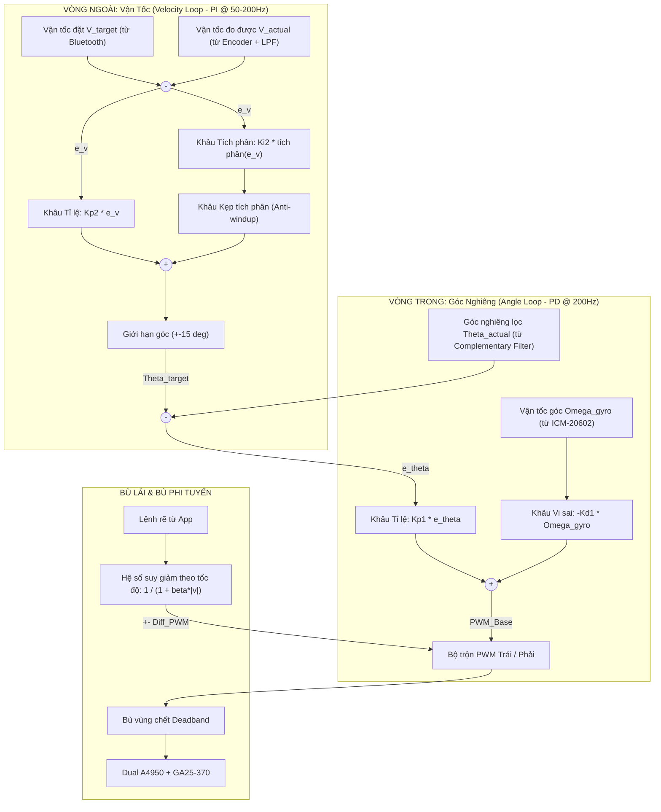
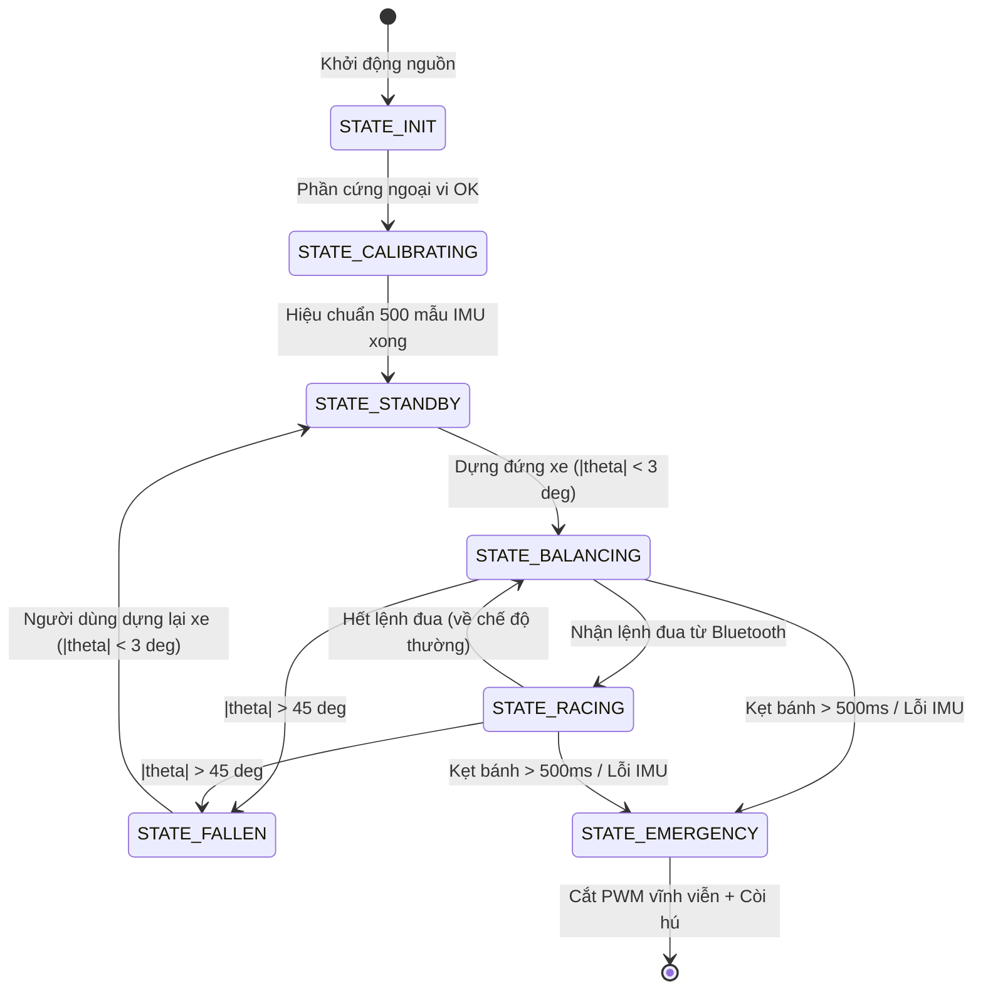

# ĐẶC TẢ THUẬT TOÁN ĐIỀU KHIỂN TỔNG THỂ — XE CÂN BẰNG 2 BÁNH TỐC ĐỘ CAO
### (In-depth Mathematical Modeling, Cascade PID Control, Non-linear Compensation & Active Safety)

> [!NOTE]
> * **Mục đích tài liệu**: Cung cấp cơ sở lý thuyết điều khiển học, mô hình động lực học và các thuật toán điều khiển thời gian thực cho dự án xe 2 bánh tự cân bằng tốc độ cao.
> * **Nền tảng vi điều khiển**: STM32F411CEU6 (ARM Cortex-M4F @ 100MHz, Single-Precision FPU).
> * **Chu kỳ điều khiển**: Định thời ngắt phần cứng chính xác $T_s = 5.000\text{ ms}$ (Tần số $f_s = 200\text{ Hz}$).

---

## 1. MÔ HÌNH HÓA TOÁN HỌC & ĐỘNG LỰC HỌC CON LẮC NGƯỢC (TWIP DYNAMICS)

Hệ thống xe cân bằng hai bánh (Two-Wheeled Inverted Pendulum - TWIP) là một hệ thống phi tuyến, thiếu cơ cấu chấp hành (Underactuated System - chỉ có 2 động cơ tác động vào 2 bánh nhưng cần kiểm soát cả vị trí bánh xe $x$ lẫn góc nghiêng thân xe $\theta$).

### 1.1. Hệ tọa độ và Phương trình Động lực học

```
         ^ y (Trục thẳng đứng, g hướng xuống)
         |
         |         /  (Thân xe ngả góc theta)
         |        /
         |       * Trọng tâm thân xe (Mass M, Quán tính J)
         |      / 
         |     /   Chiều dài từ trục bánh tới trọng tâm: L
         |    /
         |   / 
         |  /  Góc nghiêng theta (theta > 0: ngả về trước)
         | /
   [O]---(O)------> x (Vị trí xe tịnh tiến dọc mặt sàn)
      Bánh xe (Bán kính R, Khối lượng m)
```

Áp dụng phương pháp phương trình Euler-Lagrange với hàm Lagrange $L = T - V$ (Động năng trừ Thế năng):
1. **Phương trình chuyển động tịnh tiến (Trục $x$)**:
   $$(M + 2m + \frac{2J_w}{R^2})\ddot{x} + M L \ddot{\theta} \cos\theta - M L \dot{\theta}^2 \sin\theta = \frac{2}{R}\tau - F_{\text{friction}}$$
2. **Phương trình chuyển động quay của thân xe (Trục $\theta$)**:
   $$(J + M L^2)\ddot{\theta} + M L \ddot{x} \cos\theta - M g L \sin\theta = -2\tau$$

*(Trong đó: $M$ là khối lượng thân xe, $m$ là khối lượng bánh, $L$ là khoảng cách từ trục tới trọng tâm, $J$ là mô-men quán tính thân xe, $\tau$ là mô-men xoắn do mỗi động cơ sinh ra, $R$ là bán kính bánh xe).*

### 1.2. Tuyến tính hóa quanh điểm cân bằng và Bản chất mất ổn định
Quanh điểm cân bằng thẳng đứng ($\theta \approx 0 \implies \sin\theta \approx \theta, \cos\theta \approx 1, \dot{\theta}^2 \approx 0$):
Hệ phương trình vi phân biến thành hệ tuyến tính. Khi phân tích hàm truyền hoặc phương trình trạng thái:
$$s^2 - \frac{M g L}{J + M L^2} = 0 \implies s_{1,2} = \pm \sqrt{\frac{M g L}{J + M L^2}}$$

> [!WARNING]
> Hệ luôn tồn tại một nghiệm cực dương nằm ở **nửa mặt phẳng bên phải của mặt phẳng phức $s$ ($s_1 > 0$)**. Điều này chứng minh hệ thống **mất ổn định tự nhiên trong vòng hở (Open-loop Unstable)**. Nếu không có thuật toán điều khiển phản hồi vòng kín phản ứng liên tục ở tần số cao, xe sẽ đổ sập trong vòng chưa đầy $0.2\text{ giây}$.

---

### 1.3. Cơ chế Động học khi "Đua" và "Tăng tốc"

Khi xe muốn tăng tốc về phía trước với gia tốc tịnh tiến $a_x = \ddot{x} > 0$:
* Lực quán tính ảo tác dụng lên trọng tâm: $F_{\text{inertial}} = M \cdot a_x$ hướng về phía sau.
* Lực trọng trường: $F_{\text{gravity}} = M \cdot g$ hướng xuống dưới.
* Để xe không bị lật ngửa khi tăng tốc, tổng mô-men lực quay quanh trục bánh xe phải cân bằng:
  $$\sum M_{\text{wheel}} = M \cdot g \cdot L \sin\theta - M \cdot a_x \cdot L \cos\theta = 0$$
  $$\implies \tan\theta = \frac{a_x}{g} \implies \theta_{\text{target}} \approx \arctan\left(\frac{a_x}{g}\right)$$

> [!IMPORTANT]
> **Kết luận cốt lõi cho giải thuật**: Muốn xe chạy nhanh, xe **bắt buộc phải chủ động ngả về phía trước một góc $\theta_{\text{target}} > 0$**. 
> * Khi $a_x = 0$ (chạy đều hoặc đứng yên): $\theta_{\text{target}} \approx 0^\circ$.
> * Khi cần gia tốc đua: $\theta_{\text{target}}$ có thể lên tới **$+10^\circ \to +15^\circ$**.
> Do đó, ngõ ra của bộ điều khiển vận tốc (Velocity Loop) chính là **Góc nghiêng đặt ($\theta_{\text{target}}$)**, tuyệt đối không phải là PWM trực tiếp!

---

## 2. KIẾN TRÚC THỜI GIAN THỰC ĐỊNH THỜI NGẮT CỨNG 200Hz

Hệ thống sử dụng ngắt cứng Timer của STM32F411 làm nhịp tim điều khiển, phân chia ngân sách thời gian (Timing Budget) nghiêm ngặt trong chu kỳ $5000\text{ µs}$:

```
0 µs ───────────────────────────────────────────────────────────── 5000 µs
│ [Task 1] │ [Task 2] │ [Task 3] │ [Task 4] │ [Task 5] │ [Task 6] │ [Rảnh / CPU Idle]
│ Đọc IMU  │ Lọc bù   │ Encoder  │ Cascade  │ Bù lái & │ An toàn  │ Xử lý UART DMA,
│ ~380µs   │ ~40µs    │ ~60µs    │ ~120µs   │ Deadband │ & PWM    │ Telemetry & Bluetooth
│          │          │          │          │ ~50µs    │ ~80µs    │ > 4270µs (>85% rảnh)
```

1. **Task 1 (Đọc dữ liệu thô IMU)**: Đọc 14 bytes thanh ghi từ ICM-20602 qua SPI1 DMA hoặc Polling tốc độ 6.25MHz ($\approx 380\text{ µs}$).
2. **Task 2 (Ước lượng góc nghiêng)**: Chạy giải thuật Complementary Filter kết hợp FPU Cortex-M4 ($\approx 40\text{ µs}$).
3. **Task 3 (Đọc vận tốc bánh xe)**: Đọc thanh ghi phần cứng TIM2/TIM3 Encoder, tính vận tốc tịnh tiến và lọc LPF ($\approx 60\text{ µs}$).
4. **Task 4 (Tính toán Cascade PID)**: Tính toán sai số vận tốc $\rightarrow$ $\theta_{\text{target}}$, tính sai số góc $\rightarrow$ $\text{PWM}_{\text{base}}$ ($\approx 120\text{ µs}$).
5. **Task 5 (Bù phi tuyến)**: Áp dụng Steering Authority theo vận tốc và bù ma sát tĩnh Deadband ($\approx 50\text{ µs}$).
6. **Task 6 (An toàn & Xuất xung)**: Kiểm tra góc ngã, nạp thanh ghi `TIM1->CCRx` điều khiển Dual A4950 ($\approx 80\text{ µs}$).
7. **Thời gian rảnh (> 85%)**: CPU thoát ngắt để vòng lặp nền `while(1)` xử lý nhận và giải mã gói tin Bluetooth, đóng gói gửi dữ liệu Telemetry lên máy tính.

---

## 3. GIẢI THUẬT CASCADE PID 2 VÒNG LỒNG NHAU (DUAL-LOOP CASCADE)

### 3.1. Sơ đồ khối Thuật toán Điều khiển



---

### 3.2. Vòng Trong — Điều khiển Góc nghiêng (Angle Loop PD @ 200Hz)

Vòng góc nghiêng đóng vai trò là "lực giữ thăng bằng" chống lại trọng lực làm đổ thân xe.

#### Công thức toán học rời rạc tại bước $k$:
1. **Sai số góc nghiêng**:
   $$e_\theta[k] = \theta_{\text{target}}[k] - \theta_{\text{actual}}[k]$$

2. **Thành phần Tỉ lệ ($P_\theta$) — Lò xo xoắn ảo (Virtual Torsional Spring)**:
   $$P_\theta[k] = K_{p1} \cdot e_\theta[k]$$
   *Ý nghĩa*: Đóng vai trò như một chiếc lò xo cơ học. Khi thân xe bị nghiêng khỏi vị trí đặt một góc $e_\theta$, khâu $P$ lập tức sinh mô-men phản kháng kéo ngược lại. $K_{p1}$ càng lớn, xe càng "cứng vững".

3. **Thành phần Vi sai ($D_\theta$) — Bộ giảm chấn nhớt ảo (Virtual Viscous Damper)**:
   $$D_\theta[k] = -K_{d1} \cdot \omega_{\text{gyro}}[k]$$
   *Tại sao dùng $\omega_{\text{gyro}}$ thay vì $\frac{d(e_\theta)}{dt}$?*
   * Tránh hiện tượng **Derivative Kick** (Cú sốc vi sai) khi $\theta_{\text{target}}$ thay đổi đột ngột.
   * Triệt tiêu hoàn toàn việc khuếch đại nhiễu từ phép tính vi phân số $\frac{\theta[k] - \theta[k-1]}{\Delta t}$. Giá trị $\omega_{\text{gyro}}$ từ con quay hồi chuyển có độ phân giải và băng thông cực cao.

4. **Tổng hợp ngõ ra Vòng Trong**:
   $$\text{PWM}_{\text{base}}[k] = P_\theta[k] + D_\theta[k] = K_{p1} \cdot (\theta_{\text{target}}[k] - \theta_{\text{actual}}[k]) - K_{d1} \cdot \omega_{\text{gyro}}[k]$$

> [!IMPORTANT]
> **Tại sao không dùng $K_i$ ở Vòng Trong?**
> Thành phần tích phân $K_i$ đưa một cực tại gốc tọa độ, gây ra hiện tượng **trễ pha $90^\circ$**. Trong hệ con lắc ngược mất ổn định, trễ pha sẽ làm giảm nghiêm trọng biên độ dự trữ ổn định (Phase Margin), khiến xe dao động tự kích và ngã ngay lập tức. Sai số tĩnh góc do lệch trọng tâm sẽ do **Vòng ngoài (Velocity Loop)** đảm nhận bù trừ.

---

### 3.3. Vòng Ngoài — Điều khiển Vận tốc (Velocity Loop PI @ 50-200Hz)

Vòng ngoài giải quyết bài toán: Điều khiển xe bám theo vận tốc mong muốn $v_{\text{target}}$, hoặc tự động triệt tiêu trôi dốc để xe đứng yên tại một vị trí khi $v_{\text{target}} = 0$.

#### Công thức toán học rời rạc tại bước $k$:
1. **Sai số vận tốc tịnh tiến**:
   $$e_v[k] = v_{\text{target}}[k] - v_{\text{actual}}[k]$$
   *(Trong đó $v_{\text{actual}} = \frac{v_{\text{left}} + v_{\text{right}}}{2}$ đã qua bộ lọc thông thấp LPF).*

2. **Thành phần Tỉ lệ ($P_v$)**:
   $$P_v[k] = K_{p2} \cdot e_v[k]$$

3. **Thành phần Tích phân ($I_v$) — Bộ tự học điểm cân bằng tĩnh thực tế**:
   $$I_v[k] = I_v[k-1] + K_{i2} \cdot e_v[k] \cdot \Delta t$$
   *Ý nghĩa tối quan trọng của $I_v$*: Trọng tâm thực tế của xe không bao giờ nằm thẳng đứng tuyệt đối $0^\circ$ do sai số lắp ráp cơ khí, dây điện, vị trí đặt pin. Thành phần $I_v$ sẽ tự động tích lũy và tạo ra một góc nghiêng bù tĩnh $\theta_{\text{trim}}$ (ví dụ $+1.2^\circ$). Nhờ đó, xe tự động đứng yên bất động mà người dùng không cần phải căn chỉnh góc cơ khí thủ công!

4. **Tổng hợp ngõ ra Vòng Ngoài (Angle Setpoint)**:
   $$\theta_{\text{target}}[k] = \text{Clamp}\left(P_v[k] + I_v[k], -\theta_{\max}, \theta_{\max}\right)$$
   * Chế độ bình thường: $\theta_{\max} = 5.0^\circ - 8.0^\circ$.
   * Chế độ đua (Racing Mode): $\theta_{\max} = 15.0^\circ$.

---

## 4. CÁC THUẬT TOÁN PHI TUYẾN & BÙ TRỪ THỰC TẾ

### 4.1. Thuật toán Chống bão hòa tích phân (Anti-Integral Windup)
* **Hiện tượng rủi ro**: Khi người dùng cầm nhấc xe lên hoặc giữ nghiêng xe bằng tay, bánh xe quay nhưng xe không di chuyển $\rightarrow$ $e_v$ liên tục tích lũy làm $I_v$ tăng vọt lên vô cực. Khi buông tay, xe lập tức "phóng vọt" với vận tốc nguy hiểm.
* **Giải pháp: Kẹp tích phân có điều kiện (Conditional Integration)**:
  ```c
  // Chỉ cho phép tích lũy tích phân khi xe đang ở trạng thái cân bằng an toàn
  if (fabsf(theta_actual) < 15.0f && !is_fallen) {
      integral_v += Ki2 * error_v * dt;
      // Kẹp trần tích phân
      if (integral_v > MAX_ANGLE_OFFSET) integral_v = MAX_ANGLE_OFFSET;
      else if (integral_v < -MAX_ANGLE_OFFSET) integral_v = -MAX_ANGLE_OFFSET;
  } else {
      integral_v = 0.0f; // Reset tích phân ngay lập tức khi góc quá lớn
  }
  ```

---

### 4.2. Thuật toán Bù vùng chết động cơ (Deadband Compensation)
* **Hiện tượng**: Hộp số bánh răng kim loại GA25-370 có ma sát tĩnh (Stiction). Nếu điện áp cấp dưới $1.2\text{V}$ (tương đương PWM $< 10\%$), mô-men không thắng được ma sát $\rightarrow$ trục motor đứng yên. Hiện tượng phi tuyến này gây ra dao động rung lắc (Limit Cycle) quanh điểm 0.
* **Mô hình toán học hàm bù vùng chết**:
  $$u_{\text{out}} = 
  \begin{cases} 
  u_{\text{PID}} + \text{PWM}_{\text{deadband}}, & \text{khi } u_{\text{PID}} > 0 \\
  u_{\text{PID}} - \text{PWM}_{\text{deadband}}, & \text{khi } u_{\text{PID}} < 0 \\
  0, & \text{khi } u_{\text{PID}} = 0 
  \end{cases}$$

---

### 4.3. Thuật toán Bù lái thích ứng vận tốc (Velocity-adaptive Steering Authority)
Khi nhận lệnh rẽ từ app Bluetooth, hệ thống cộng/trừ vi sai vào 2 bánh:
$$\text{PWM}_{\text{Left}} = \text{PWM}_{\text{base}} + \Delta\text{PWM}_{\text{steer}}$$
$$\text{PWM}_{\text{Right}} = \text{PWM}_{\text{base}} - \Delta\text{PWM}_{\text{steer}}$$

* **Vấn đề khi đua**: Ở tốc độ cao ($v > 1.5\text{ m/s}$), nếu giữ nguyên biên độ bẻ lái như khi đi chậm, lực ly tâm sẽ làm xe **trượt văng bánh hoặc lật ngang ngay lập tức**.
* **Công thức suy giảm phi tuyến thích ứng theo vận tốc**:
  $$\Delta\text{PWM}_{\text{steer}} = \frac{\text{SteerCmd}}{1.0 + \beta \cdot |v_{\text{actual}}|}$$
  *(Với $\beta = 1.2$ là hệ số suy giảm thực nghiệm).*
  * Khi xe đứng yên ($v \approx 0$): Hệ số bằng $1.0 \implies$ Quay tròn tại chỗ cực kỳ linh hoạt.
  * Khi xe phóng nhanh ($v$ lớn): Hệ số bẻ lái tự động thu nhỏ lại $\implies$ Xe vào cua mượt mà, bám đường, không bị lật.

---

## 5. MÁY TRẠNG THÁI HỆ THỐNG (FINITE STATE MACHINE - FSM)



---

## 6. MÃ NGUỒN C CHUẨN HÓA THUẬT TOÁN ĐIỀU KHIỂN

Đoạn mã C hoàn chỉnh thực thi bên trong ngắt cứng `TIM4_IRQHandler()` mỗi 5ms:

```c
void Cascade_PID_Compute_5ms(void) {
    // 1. Đọc cảm biến quán tính ICM-20602 & tính lọc bù
    ICM20602_Read_Burst(&g_imu);
    float theta_acc = atan2f(g_imu.ax, g_imu.az) * 57.2957795f;
    g_robot.pitch = 0.98f * (g_robot.pitch + g_imu.gy * 0.005f) + 0.02f * theta_acc;

    // 2. Đọc Encoder & lọc vận tốc tịnh tiến
    Encoder_Update(&g_enc_left, &g_enc_right, 0.005f);
    float v_actual = (g_enc_left.velocity_m_s + g_enc_right.velocity_m_s) * 0.5f;

    // 3. Kiểm tra máy trạng thái & Cơ chế an toàn
    if (fabsf(g_robot.pitch) > 45.0f) {
        A4950_Set_Duty(0, 0);
        g_robot.state = STATE_FALLEN;
        g_pid_vel.integral = 0.0f; // Reset tích phân
        return;
    }

    if (g_robot.state == STATE_STANDBY) {
        if (fabsf(g_robot.pitch) < 3.0f) {
            g_robot.state = STATE_BALANCING;
        } else {
            A4950_Set_Duty(0, 0);
            return;
        }
    }

    // 4. VÒNG NGOÀI: Velocity Loop PI (Tạo Angle Setpoint Offset)
    float e_v = g_robot.v_target - v_actual;
    g_pid_vel.integral += g_pid_vel.Ki * e_v * 0.005f;
    // Kẹp tích phân chống windup (+- 10 độ)
    if (g_pid_vel.integral > 10.0f) g_pid_vel.integral = 10.0f;
    else if (g_pid_vel.integral < -10.0f) g_pid_vel.integral = -10.0f;

    float theta_target = (g_pid_vel.Kp * e_v) + g_pid_vel.integral;
    float max_tilt = (g_robot.state == STATE_RACING) ? 15.0f : 8.0f;
    if (theta_target > max_tilt) theta_target = max_tilt;
    else if (theta_target < -max_tilt) theta_target = -max_tilt;

    // 5. VÒNG TRONG: Angle Loop PD (Tạo Base PWM)
    float e_theta = theta_target - g_robot.pitch;
    float pwm_base = (g_pid_angle.Kp * e_theta) - (g_pid_angle.Kd * g_imu.gy);

    // 6. Bù vi sai lái thích ứng vận tốc
    float adaptive_steer = g_robot.steer_cmd / (1.0f + 1.2f * fabsf(v_actual));
    float pwm_l = pwm_base + adaptive_steer;
    float pwm_r = pwm_base - adaptive_steer;

    // 7. Bù vùng chết ma sát tĩnh hộp số GA25
    int16_t out_l = Apply_Deadband(pwm_l, 250, 2499);
    int16_t out_r = Apply_Deadband(pwm_r, 250, 2499);

    // 8. Xuất xung ra Driver Dual A4950
    A4950_Set_Duty(out_l, out_r);
}
```
