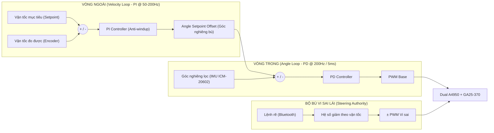

# ROADMAP CHUẨN HÓA — XE CÂN BẰNG 2 BÁNH
### (Tự Đứng Thăng Bằng + Chế Độ Đua Tốc Độ Cao)

> [!NOTE]
> **Cơ sở xây dựng tài liệu:**
> Tài liệu này được biên soạn dựa trên đối chiếu roadmap gốc của bạn với các nguồn học thuật (*Cascade PID cho balancing robot*), tài liệu hãng (*Allegro A4950 datasheet, STM32 HAL Reference*), và các dự án thực chiến nổi tiếng trong cộng đồng (*TKJ Electronics/Balanduino, Elexperiment.nl High-speed Balancing Robot, balance_bot BeagleBone*).
> 
> **Mục tiêu:** Giữ nguyên tinh thần BOM và 5 giai đoạn bạn đã vạch ra, đồng thời bổ sung các điểm mà nhiều người build balancing robot hay vấp phải, đặc biệt khi kết hợp với mục tiêu **ĐUA (tốc độ cao)**.

---

## 0. NGUYÊN LÝ ĐIỀU KHIỂN CỐT LÕI (Nền tảng cho toàn bộ roadmap)

Xe cân bằng 2 bánh về bản chất là bài toán **con lắc ngược (inverted pendulum)** — một hệ thống có tính chất **mất ổn định tự nhiên**.

Kiến trúc điều khiển chuẩn được hầu hết tài liệu học thuật và các robot nổi tiếng (*Balanduino của TKJ Electronics, robot BeagleBone của nhóm balance_bot, robot tốc độ cao của Elexperiment.nl*) đồng thuận sử dụng là **Cascade PID 2 vòng lồng nhau**, đúng như bạn đã phác thảo ở Giai đoạn 4:



### Chi tiết cơ chế 2 vòng lồng nhau:

*   **Vòng trong (Angle loop – PD hoặc PID)**:
    *   **Input**: Góc nghiêng thực tế (từ bộ lọc cảm biến IMU).
    *   **Setpoint**: Góc mục tiêu (nhận từ ngõ ra của Vòng ngoài).
    *   **Tần số thực thi**: Chạy ở tần số cao nhất (**200Hz / 5ms** khuyến nghị cho xe đua, xem mục 2.3).
    *   **Output**: Xuất trực tiếp giá trị **PWM** ra driver động cơ Dual A4950.
*   **Vòng ngoài (Velocity loop – PI)**:
    *   **Input**: Vận tốc bánh xe đo từ Encoder.
    *   **Setpoint**: Vận tốc mong muốn (bằng `0` khi cần đứng yên tại chỗ).
    *   **Output**: **Không điều khiển động cơ trực tiếp** — nó cộng vào làm **setpoint góc nghiêng** cho vòng trong.

> [!IMPORTANT]
> **Điểm mấu chốt khi lập trình:**
> Xe không bao giờ "đứng thẳng tuyệt đối" khi di chuyển mà nó chủ động ngả người ra trước/sau một góc nhỏ để tạo lực gia tốc, tương tự cách giữ thăng bằng cây gậy trên lòng bàn tay.
> 
> $\rightarrow$ Do đó, trong code: $\text{Outer Loop Output} = \text{Angle Setpoint Offset}$, **tuyệt đối không phải là PWM Offset**.

---

## 1. RÀ SOÁT & GHI CHÚ KỸ THUẬT CHO BOM

Bảng BOM gốc của bạn về cơ bản là một lựa chọn tốt, cân bằng giữa chi phí và hiệu năng. Dưới đây là các điểm cần lưu ý/validate thêm khi triển khai thực tế:

| Linh kiện | Đánh giá | Lưu ý kỹ thuật quan trọng |
| :--- | :--- | :--- |
| **STM32F411CEU6** | **Hợp lý**<br>• Cortex-M4F có FPU<br>• Đủ tài nguyên Timer | F411 có **6 timer general-purpose**, cần quy hoạch trước:<br>• 1 timer ngắt vòng lặp chính (200Hz)<br>• 2 timer ở chế độ Encoder (mỗi bánh 1 timer)<br>• 1 timer PWM 4 kênh cho A4950.<br><br>> [!TIP]<br>> Cộng đồng từng ghi nhận một số timer (vd TIM4) có hành vi khác nhau giữa các dòng STM32F4 khi cấu hình Encoder Mode — nên test cấu hình Encoder Mode **sớm, độc lập**, trước khi tích hợp toàn hệ thống. |
| **ICM-20602** | **Đúng chuẩn**<br>• Cảm biến FPV racing drone<br>• Dải đo lớn, chịu rung tốt | **Vibration isolation (đệm xốp) là bắt buộc, không phải tùy chọn:**<br>Nhiều report thực tế cho thấy bề mặt gồ ghề (nhựa đường, bê tông nhám) gây nhiễu rung khiến bộ lọc góc sai lệch và xe ngã ngay khi tăng tốc — với mục tiêu ĐUA trên nhiều loại mặt sàn, đây là rủi ro cần test kỹ ở Giai đoạn 6. |
| **2x GA25-370<br>+ Hall Encoder** | **Phù hợp**<br>• 11–13 xung/vòng trục motor<br>• Tỉ số truyền ~1:30<br>• $\approx$ 330–400 xung/vòng bánh | > [!WARNING]<br>> **Không nên tin số liệu PPR trên datasheet tuyệt đối** — hãy đo thực tế (quay đúng $N$ vòng bằng tay, đếm xung) để calibrate hệ số quy đổi xung $\rightarrow$ vận tốc trong code.<br><br>Dùng STM32 Timer Encoder Mode ở chế độ đếm cả 2 cạnh (TI1 + TI2) để có **độ phân giải x4**, giúp vòng Velocity PID mượt hơn ở tốc độ thấp. |
| **Dual A4950** | **Tốt**<br>• Dòng đỉnh 3.5A<br>• $V_{BB}$ 8–40V (an toàn với 3S) | Cần đọc kỹ datasheet Allegro để tránh lỗi layout:<br>• A4950 dùng PWM current-mode với *fixed off-time* và có chân **VREF** để giới hạn dòng qua điện trở sense — **cần thêm biến trở/chia áp VREF** trong mạch, nếu không driver sẽ chạy ở dòng giới hạn mặc định không tối ưu cho việc phanh gấp.<br>• Hãy làm **Star-ground** ngay dưới A4950 như khuyến nghị datasheet.<br>• Cách ly tốt đường mạch công suất PWM 20–40kHz khỏi đường tín hiệu I2C/SPI của ICM-20602 — nhiễu xung từ driver là nguyên nhân phổ biến gây đọc sai IMU. |
| **Pin LiPo 3S<br>(25–35C)** | **Phù hợp**<br>• 9.9V – 12.6V | Không có ghi chú thêm, lựa chọn đúng đắn cho ứng dụng xả dòng cao khi phanh/tăng tốc gấp. |
| **Buck XL4015 (5A)** | **Tốt**<br>• Dòng ra khỏe | Thêm tụ lọc gần chân 5V của STM32 và ICM-20602 để giảm gợn áp (ripple) — đặc biệt quan trọng vì mạch số và cảm biến rất nhạy với nhiễu nguồn khi motor đang PWM tần số cao gần đó. |
| **Khung 2 tầng<br>Mica / Phíp** | **Đúng nguyên tắc**<br>• Hạ thấp trọng tâm | Xem ghi chú ở Giai đoạn 1 bên dưới về **độ cao trọng tâm tối ưu cho xe đua** (khác một chút so với xe chỉ cần đứng yên). |
| **HC-05 / JDY-31** | **Phù hợp**<br>• Tune PID không dây<br>• Điều khiển từ xa | Cấu hình baudrate cao (**115200**) qua lệnh AT để truyền dữ liệu telemetry (góc, PWM, tốc độ) mượt hơn khi debug.<br><br>> [!TIP]<br>> Nhiều dự án mã nguồn mở (*Balanduino, robot Elexperiment*) đều có tính năng "live plotting" qua kết nối không dây, giúp tune PID nhanh hơn nhiều so với chỉ nhìn LED/Serial text. |

---

## 2. ROADMAP TRIỂN KHAI — 6 GIAI ĐOẠN
*(Mở rộng và chuẩn hóa từ 5 giai đoạn gốc)*

```
  [GIAI ĐOẠN 1] ──> [GIAI ĐOẠN 2] ──> [GIAI ĐOẠN 3] ──> [GIAI ĐOẠN 4] ──> [GIAI ĐOẠN 5] ──> [GIAI ĐOẠN 6]
   Cơ khí &          Điện &            Xử lý tín hiệu     Cascade PID       Tối ưu Đua &       Kiểm thử &
   Trọng tâm         Ngoại vi          & Ngắt 200Hz       2 vòng lồng       Không dây          An toàn
```

---

### 🔹 Giai đoạn 1: Lắp ráp Cơ khí & Phân bổ Trọng tâm

Giữ nguyên cấu trúc 2 tầng bạn đề ra, bổ sung:

*   **Trọng tâm cho xe ĐUA khác một chút so với xe chỉ cần đứng yên tại chỗ**:
    *   Trọng tâm thấp giúp xe phản ứng nhanh (mô-men quán tính quay nhỏ), nhưng một khối lượng đủ lớn đặt hợp lý cũng giúp xe "ngã chậm hơn" — dễ kiểm soát vòng lặp điều khiển hơn.
    *   Với xe đua, ưu tiên **trọng tâm thấp và cân đối 2 bên**, tránh đặt pin/driver quá cao vì sẽ làm chậm phản ứng khi vào cua tốc độ cao.
*   **Triệt tiêu độ rơ (backlash) tại khớp nối trục D 4mm**:
    *   Đây là nguyên nhân phổ biến khiến vòng điều khiển trở nên phi tuyến (non-linear), rất khó tune PID ổn định.
    *   Hãy dùng keo khóa ren (threadlocker) hoặc siết chặt định kỳ, kiểm tra độ rơ trước khi bước sang Giai đoạn 2.
*   **Đảm bảo đồng trục và đối xứng**:
    *   Trục 2 bánh phải **đồng trục tuyệt đối** và khối lượng đối xứng trái–phải, nếu không xe sẽ tự lệch hướng ngay cả khi PID góc nghiêng hoạt động hoàn hảo (do lệch trọng tâm gây moment xoay quanh trục thẳng đứng).

---

### 🔹 Giai đoạn 2: Thiết lập Hệ thống Điện & Cấu hình Ngoại vi

Giữ nguyên các bước bạn đã liệt kê, bổ sung bảng quy hoạch Timer để tránh xung đột khi lập trình:

#### Bảng quy hoạch Timer trên STM32F411:

| Timer | Chế độ cấu hình | Chức năng chi tiết | Ghi chú kỹ thuật |
| :--- | :--- | :--- | :--- |
| **TIMx** *(vd TIM2)* | `TIM_ENCODERMODE_TI12` | Đọc Encoder – Bánh Trái | Cấu hình bộ lọc đầu vào `filter IC ~10` để lọc nhiễu cơ khí |
| **TIMy** *(vd TIM3)* | `TIM_ENCODERMODE_TI12` | Đọc Encoder – Bánh Phải | Tương tự bánh trái, đếm cả 2 cạnh TI1 & TI2 |
| **TIMz** *(vd TIM1)* | `PWM Generation CH1..CH4` | Phát xung PWM 4 kênh cho Dual A4950 | Tần số **20kHz**, cấu hình căn giữa (*center-aligned*) nếu cần giảm nhiễu âm thanh |
| **TIMw** *(vd TIM4/TIM5)* | `Base Timer Interrupt` | Ngắt định thời vòng lặp điều khiển chính | Chu kỳ **200Hz (5ms)** — xem chi tiết ở Giai đoạn 3 |

*   **Thiết lập chân VREF trên A4950**: Nhớ thêm mạch chia áp/biến trở tại chân **VREF** để set dòng giới hạn (*current limit*) — không để mặc định, vì mục tiêu "phanh gấp" cần dòng đỉnh cao nhưng vẫn phải giới hạn để bảo vệ motor/driver khỏi quá nhiệt.
*   **Đo kiểm điện áp bằng VOM**: Đặc biệt đo điện áp ra của mạch Buck **dưới tải thực tế** (khi motor đang chạy), vì điện áp không tải và có tải có thể lệch nếu chất lượng mạch buck không đạt yêu cầu.

---

### 🔹 Giai đoạn 3: Xử lý Tín hiệu Cảm biến & Định thời Ngắt

*   **Tần số vòng lặp điều khiển**:
    *   Bạn đề xuất 5ms/10ms (100–200Hz) — với mục tiêu ĐUA, hãy chọn **200Hz (5ms)** làm mặc định, không phải tùy chọn phụ.
    *   Các robot cân bằng tốc độ cao trong cộng đồng (*ví dụ robot của Elexperiment.nl, hay dự án balance_bot chạy trên BeagleBone*) đều chạy vòng lặp ở 100–200Hz; ở tốc độ cao, nhiễu loạn (*disturbance*) xảy ra rất nhanh nên vòng lặp chậm sẽ không kịp phản ứng.
*   **Bộ lọc bù (Complementary Filter)**:
    *   Công thức chuẩn cộng đồng tin dùng:
        $$\theta = \alpha \cdot (\theta_{prev} + \omega_{gyro} \cdot \Delta t) + (1 - \alpha) \cdot \theta_{accel}$$
    *   Hệ số $\alpha$ cấu hình trong khoảng **0.96 – 0.98** (gyro chiếm ưu thế ngắn hạn, accelerometer sửa trôi dài hạn).
    *   *So sánh với Kalman Filter*: Bộ lọc bù đơn giản, nhẹ tính toán hơn nhiều so với Kalman filter mà độ chính xác thực tế không thua kém đáng kể. Nhiều thực nghiệm cho thấy Kalman filter phản hồi "trễ" hơn một chút so với complementary filter dù mượt hơn về nhiễu cao tần. Với STM32F411 có FPU, bạn hoàn toàn đủ tài nguyên để làm Kalman filter nếu muốn, nhưng **complementary filter là lựa chọn an toàn để bắt đầu**, sau đó nâng cấp nếu cần.
*   **Calibration Offset**:
    *   Lấy trung bình vài trăm mẫu khi xe đứng yên thẳng đứng để tính offset tĩnh, thay vì chỉ lấy 1 mẫu — giảm thiểu tối đa sai số ngẫu nhiên của cảm biến.

---

### 🔹 Giai đoạn 4: Lập trình Thuật toán Cascade PID

Thứ tự tune PID được khuyến nghị rộng rãi trong tài liệu và các dự án thực chiến (tránh tune "mò" ngẫu nhiên cả 6 hệ số cùng lúc):

1.  **Tune vòng trong (Angle) trước, chỉ với $K_{p1}$**: Tăng dần $K_{p1}$ đến khi xe có thể tự đứng nhưng xuất hiện dao động rung lắc (*oscillation*) quanh điểm cân bằng.
2.  **Thêm vi sai $K_{d1}$ để dập tắt dao động**: Đây là bước quan trọng nhất để có một vòng trong "cứng cáp". Hầu hết balancing robot **không cần $K_{i1}$ ở vòng trong** (hoặc chỉ cần rất nhỏ), vì bản thân vòng ngoài (Velocity) đã đảm nhiệm việc triệt tiêu trôi vị trí.
3.  **Bật vòng ngoài (Velocity PI) sau khi vòng trong đã ổn định**: Dùng số xung Encoder/chu kỳ lấy mẫu để tính vận tốc, so sánh với setpoint (`0` khi đứng yên), output cộng vào setpoint góc của vòng trong.
4.  **Cảnh báo về hiện tượng Integral Windup**:
    > [!WARNING]
    > **Lỗi cực kỳ phổ biến:** Nếu xe bị giữ nghiêng quá lâu (ví dụ trong lúc tay người dùng đang giữ để test), thành phần $I$ sẽ tích lũy tràn (*wind-up*), và khi thả tay ra xe sẽ "phóng" đi bất thường gây nguy hiểm.
    > 
    > $\rightarrow$ **Giải pháp bắt buộc:** Hãy giới hạn (*clamp*) cả thành phần tích phân $I$ và output PWM cuối cùng trong code.
5.  **Tận dụng Bluetooth để tune PID trực tiếp**: Sử dụng module Bluetooth (có sẵn trong BOM) để **tune PID không dây thời gian thực khi xe đang chạy**, tránh việc phải cắm nạp lại firmware mỗi lần thay đổi hệ số.

---

### 🔹 Giai đoạn 5: Tối ưu Chế độ Đua & Điều khiển Không dây

*   **Bộ bù vi sai (Differential Drive)**: Nguyên lý cộng/trừ PWM giữa 2 bánh khi rẽ là cách tiếp cận chuẩn, được dùng trong chính các robot Balanduino/full-size của TKJ Electronics.
*   **Điều chỉnh độ nhạy lái theo vận tốc (Steering Authority)**:
    > [!IMPORTANT]
    > Nên **giảm biên độ bù lái khi tốc độ cao**, tăng biên độ khi tốc độ thấp. Nếu không, một lệnh rẽ gấp ở tốc độ cao sẽ khiến chênh lệch PWM giữa 2 bánh quá lớn, gây lật ngang hoặc trượt bánh đột ngột.
*   **Tăng góc nghiêng cho phép ($\pm 5^\circ \rightarrow \pm 15^\circ$)**:
    *   Cần thử nghiệm **tăng dần từng bước nhỏ** (ví dụ: $\pm 5^\circ \rightarrow \pm 8^\circ \rightarrow \pm 11^\circ \rightarrow \pm 15^\circ$).
    *   Tuyệt đối không nhảy thẳng lên góc lớn nhất: Vì góc nghiêng càng lớn, nếu vòng lặp điều khiển không đủ nhanh (xem lại Giai đoạn 3: 200Hz), xe sẽ bị ngã trước khi PID kịp sinh đủ mô-men phản ứng.

---

### 🔹 Giai đoạn 6 (BỔ SUNG MỚI): Kiểm thử, An toàn & Tối ưu hoá cuối cùng

*Giai đoạn này rất quan trọng đối với một robot **đua tốc độ cao**, nơi rủi ro va chạm và ngã cao hơn nhiều so với robot chỉ đứng yên trình diễn:*

*   **Cơ chế phát hiện ngã (Fall Detection) & Cắt khẩn cấp**:
    *   Nếu góc nghiêng vượt ngưỡng an toàn (ví dụ: $|\theta| > 45^\circ$), phần mềm phải **tự động cắt PWM về 0 ngay lập tức**.
    *   Tránh để động cơ/driver tiếp tục quay khi xe đã ngã nằm sàn (gây cháy driver A4950, kẹt mòn bánh răng hộp số, hoặc xả cạn pin).
*   **Giám sát điện áp pin (Low Voltage Cutoff)**:
    *   Đọc điện áp pin LiPo qua ADC, phát tín hiệu còi Buzzer cảnh báo khi điện áp khối 3S xuống dưới ngưỡng an toàn ($\approx 9.9\text{V}$, tương đương $3.3\text{V}/\text{cell}$) để chống phù/hỏng pin.
*   **Kiểm tra nhiễu điện từ (EMI)**:
    *   Kiểm tra nhiễu giữa đường dây công suất động cơ PWM 20–40kHz và bus I2C/SPI của ICM-20602: Tăng dần công suất động cơ và quan sát dữ liệu IMU xem có bị gai nhiễu đột biến không.
*   **Kiểm thử trên nhiều loại bề mặt sàn**:
    *   Thử nghiệm trên sàn gạch men bóng, thảm, nhựa, và sân bê tông/nhựa đường nhám.
    *   Bề mặt gồ ghề gây rung chấn cao tần lọt vào accelerometer — cần tinh chỉnh hệ số $\alpha$ của bộ lọc bù hoặc bổ sung low-pass filter riêng cho từng điều kiện mặt sân.
*   **Ghi log dữ liệu qua Bluetooth để phân tích offline**:
    *   Ghi lại góc nghiêng, giá trị PWM, vận tốc encoder theo thời gian thực (xuất file CSV) giúp bạn đánh giá đồ thị đáp ứng bước (*Step Response*) khi tune PID thay vì chỉ phán đoán bằng mắt thường.

---

## 3. TỔNG HỢP CÁC RỦI RO KỸ THUẬT THƯỜNG GẶP

| STT | Hiện tượng rủi ro | Nguyên nhân cốt lõi | Biện pháp phòng tránh & Xử lý |
| :---: | :--- | :--- | :--- |
| **1** | PID không hội tụ, xe rung lắc mãi không đứng yên | Độ rơ cơ khí (*backlash*) ở khớp nối trục D 4mm của bánh xe | Siết chặt ốc lục giác, dùng keo khóa ren threadlocker, kiểm tra kỹ ở Giai đoạn 1. |
| **2** | Xe bị "phóng" vọt bất thường sau khi tay người buông ra | Thành phần tích phân bị tràn (*Integral windup*) ở vòng Velocity | Kẹp biên độ tích phân (*Integral Clamping*) và giới hạn output PWM trong code. |
| **3** | Cảm biến IMU đọc dữ liệu sai khi motor quay tải nặng | Nhiễu điện từ (EMI) do xung PWM 20–40kHz cảm ứng sang dây tín hiệu | Đi dây Star-ground, tách biệt đường công suất và tín hiệu, bổ sung tụ lọc gốm gần IC. |
| **4** | Xe ngã ngay khi vừa tăng tốc trên mặt sàn thô nhám | Rung động cơ học bề mặt lọt vào gia tốc kế (Accelerometer) | Lắp đệm xốp chống rung FPV cho ICM-20602, tinh chỉnh giảm nhẹ hệ số $\alpha$ lọc bù. |
| **5** | Vận tốc đo được không phản ánh đúng thực tế | Thông số PPR của Encoder thực tế sai lệch so với datasheet | Quay trục bánh xe bằng tay đúng $N$ vòng, đếm số xung thực tế để hiệu chuẩn hệ số. |
| **6** | Xe bị lật ngang khi thực hiện vào cua tốc độ cao | Lực bù vi sai (*differential*) giữa 2 bánh quá lớn ở vận tốc cao | Lập trình thuật toán tự động giảm biên độ bù lái tỉ lệ nghịch với vận tốc thực tế. |
| **7** | Driver A4950 hoặc motor bị quá nhiệt khi chạy liên tục | Dòng điện đỉnh khi phanh gấp không được kiểm soát | Cài đặt chân VREF trên A4950 chính xác bằng cầu phân áp, giám sát nhiệt độ khi test bền. |

---

## 4. NGUỒN THAM KHẢO CHÍNH

1.  **Cascade PID cho balancing robot** (*Nghiên cứu học thuật*): Nguyên lý điều khiển 2 vòng lồng nhau Velocity + Angle Dual-loop Control.
2.  **Complementary Filter vs Kalman Filter**: Nghiên cứu thực nghiệm so sánh đáp ứng và độ trễ trên hệ thống xe tự cân bằng.
3.  **TKJ Electronics — Balanduino & Full-size DIY Balancing Robot**: Kiến trúc tham chiếu chuẩn mực cho phần cứng, bộ lọc góc và vi sai bánh.
4.  **Elexperiment.nl — High-speed Balancing Robot**: Thiết kế robot cân bằng hướng tới tốc độ cao, vòng lặp chuẩn 200Hz và giải pháp vận hành thực tế.
5.  **Allegro MicroSystems — A4950 Datasheet**: Hướng dẫn thông số dòng điện $I_{\max}$, chân VREF và khuyến nghị layout mạch in.
6.  **STM32 HAL Timer Encoder Mode**: Tài liệu chính thức cấu hình Timer giao tiếp bộ mã hóa xung trên dòng STM32F4.
7.  **balance_bot (BeagleBone Green)**: Dự án mã nguồn mở thực chiến áp dụng Cascade PID trên robot con lắc ngược.

---

> [!NOTE]
> **Lời khuyên thực chiến:**
> BOM và cấu trúc 5 giai đoạn gốc của bạn đã đi đúng hướng và tương đối hoàn chỉnh. Tài liệu roadmap chuẩn hóa này bổ sung các chi tiết thực nghiệm (*thứ tự tune PID, quy hoạch timer, tần số 200Hz, các cơ chế an toàn và phòng chống rủi ro*) nhằm giúp bạn rút ngắn số vòng thử – sai và hoàn thành đồ án một cách tối ưu nhất.
